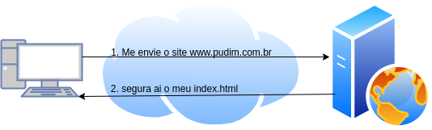
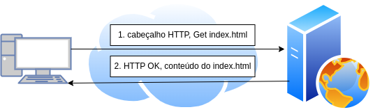
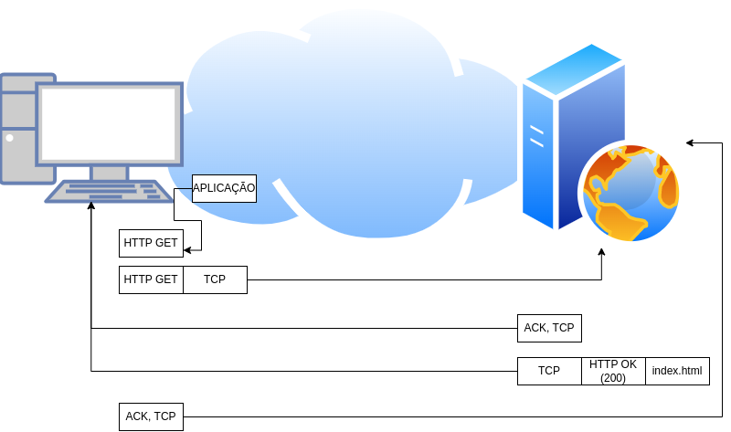
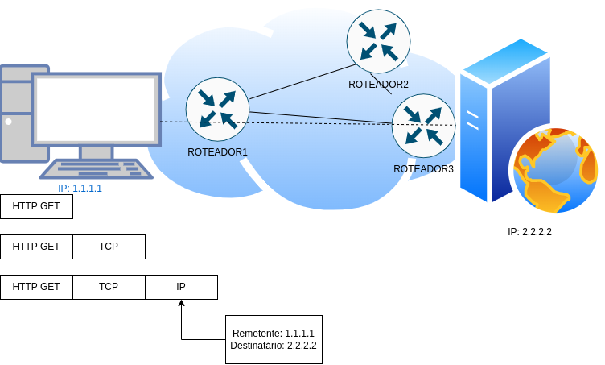
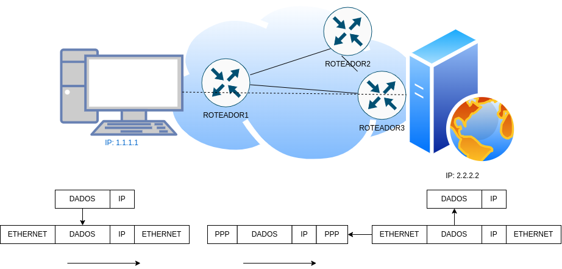
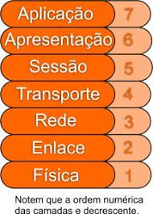

# Os modelos de rede tcp/ip e osi

A expressão modelo de redes ou arquitetura de redes, refere-se a um conjunto organizado de documentos.

Individualmente, descrevem uma pequena função para uma rede. Essas docs também podem definir protolos, que nada mais são do que definições de regras lógicas que os dispositivos devem seguir para se comunicarem.

Outros documentos podem definir a voltagem e os níveis de corrente usados em determinado meio físico, como um cabo de par trançado, por exemplo. 

Em conjuntos, esses documentos definem todos os detalhes de como criar uma rede funcional completa.

É disso que se trata o modelo osi e ou modelo tcp ip.

Esses padrões foram criados para que diferentes dispositivos de diferentes fabricantes pudessem
trocar dados entre si.

Essa história toda remonta lá na decáda de 70 quando a organização de padrão internacional (iso) viu que estava uma festa da fruta danada e resolveu criar um padrão aberto, ou melhor o modelo de redes de interconexão de sistemas abertos (osi)

Nesse meio tempo, o departamento de defesa do estados unidos da america criavam o modelo tcp/ip.

Entre modelo osi e modelo tcp/ip o modelo tcp/ip acabou vencendo, muito por conta do processo de desenvolvimento mais formal e lento do modelo osi. Ainda hoje existe dispositivos que utilizam o modelo osi como padrão, mas o modelo que podemos dizer que é dominante é o modelo tcp/ip.

Atualmente, todo sistema operacional suporta o conjunto de protocolos chamado tcp/ip, seja mobile, mac, linux ou Windows.

## Arquitetura TCP/IP

| Camada da arquitetura tcp/ ip | exemplo de protocolo  |
|-------------------------------|-----------------------|
| Aplicação                     | https, smtp, pop3     |
| Transporte                    | tcp, udp              |
| Internet                      | ip                    |
| Acesso a rede                 | ethernet, frame relay |

### A camada de aplicação do tcp / ip

A camada de aplicação fornece uma interface entre os softwares rodando no computador ou servidor e a própria rede.

Um exemplo bem prático do dia a dia é o acesso a uma página web:



Este simples exemplo utiliza 2 protocolos da camada de aplicação tcp/ip, a requisição utiliza o protocolo de transferência de hypertexto (http) e a linguagem markup de hipertexto (html). Lembrando que o html é uma das muitas especificações que define como o navegador deverá interpretar o texto contido dentro do arquivo que o solicitante acabou de receber.

Decompondo a imagem, é possível ter uma boa idéia de como os protolos de rede funcionam:



Para obter a página do site pudim.com.br, o solicitante envia algo chamado "cabeçalho http" para o servidor web. Esse cabeçalho inclui o comando para se obter (GET) um arquivo, quando o nome do arquivo não é enviado na requisição, o servidor web assume que o solicitante deseja obter a página padrão (index.html)

A resposta do servidor também inclui um cabeçalho http, como algo como um simples "OK". Na realidade,
o cabeçalho inclui um código de retorno HTTP, o qual indica que a requisição pode ser atendida.

Por exemplo, se uma página web não for encontrada durante a requisição do solicitante, a resposta do servidor deve incluir o código HTTP 404 (Não encontrado).

Esses códigos HTTP são chamados de Response Status Codes e são divididos em 5 categorias:

1. Respostas com algum tipo de informação (100 – 199)
2. Respostas com sucesso (200 – 299)
3. Mensagens de redirecionamentos (300 – 399)
4. Erro do lado do cliente (400 – 499)
5. Erro do lado do servidor (500 – 599)

Veja na prática utilizando o comando curl:

1. Requisição (GET) válida

```bash
➜  ~ curl -I http://pudim.com.br/                
HTTP/1.1 200 OK
Date: Sun, 04 Dec 2022 15:38:00 GMT
Server: Apache/2.4.34 (Amazon) OpenSSL/1.0.2k-fips PHP/5.5.38
Last-Modified: Wed, 23 Dec 2015 01:18:20 GMT
ETag: "353-527867f65e8ad"
Accept-Ranges: bytes
Content-Length: 851
Content-Type: text/html; charset=UTF-8
```

2. Requisição (GET) inválida

```bash
➜  ~ curl -I http://pudim.com.br/fotos/pudim.jpeg
HTTP/1.1 404 Not Found
Date: Sun, 04 Dec 2022 15:38:33 GMT
Server: Apache/2.4.34 (Amazon) OpenSSL/1.0.2k-fips PHP/5.5.38
Content-Type: text/html; charset=iso-8859-1
```

Este simples exemplo entre o solicitante e o servidor web introduz um dos mais imortantes conceitos gerais por trás dos modelos de redes: Quando uma determinada camada de um dispositivo deseja se comunicar com a mesma camada de outro dispositivo, como ilustrado acima, cabeçalhos são utilizados para armazenar os dados que serão trocados entre origem e destino. Este processo é chamado de interação de mesma camada.

Os protocolos da camada de aplicação tcp/ip fornecem serviços para as aplicações que são executadas
em dispositivos, seja um servidor web, etc. A camada de aplicação não define a aplicação em si, mas sim os serviços dos quais as aplicações precisam, como por exemplo, a capacidade de transferir arquivos, neste exemplo, o HTTP. A camada de aplicação fornece uma interface entre os softwares executando no dispositivo e a própria rede.

### A camada de transporte do tcp / ip

Enquanto a camada de aplicação é recheada de protocolos, a camada de transporte conta basicamente com o protocolo tcp e udp.

Cada camada fornece um serviço para a camada acima dela. Como no exemplo de uma requisição web, qual seria o resultado se a requisição HTTP get do solicitante tivesse se perdido no caminho através de uma rede tcp/ip? Ou então se a resposta do web server tivesse se perdido? O resultado lógico é que o site pudim.com.br não teria sido renderizado no solicitante.

Dessa forma, o tcp/ip precisa de um mecanismo para garantir a entrega dos dados através de uma rede e o tcp fornece recursos de correção de erros para os protocolos de aplicação, usando reconhecimentos (ack, acknowledgements)



O solicitante envia uma requisição para o servidor web que é entregue através do protocolo tcp de maneira confiável. O tcp envia os dados http do solicitante para o servidor web e os dados chegam com sucesso.

O software tcp do servidor web reconhece o recebimento da requisição (ack) e também repassa para o software que executa o web server a requisição HTTP get. O inverso ocorre com a resposta do servidor web que também chega ao solicitante com sucesso.

Este exemplo demonstra uma função chamada de interação de camadas adjacentes, a qual define os conceitos de como as camadas adjacentes de um modelo de redes, no mesmo computador, funcionam em conjunto. O protocolo de camada mais alta (http) precisa fazer algo que não é capaz (recuperação de erros), assim, a camada de transporte o realiza.

### A camada de internet tcp/ip

As camadas de aplicação e de transporte funcionam da mesma forma, independentemente de origem e destino estarem na mesma rede ou do outro lado do planeta. As duas camadas inferiores do tcp/ip, a camada internet e a camada de acesso à rede precisam entender a rede física subjacente, pois elas definem os protocolos usados para se entregar dados de um dispositivo para o outro.

A camada internet do modelo tcp/ip, constituida primordialmente do protocolo internet (ip). O ip define endereços para que cada dispositivo possa ter um endereço ip diferente. Também define o processo de roteamento de modo que dispositivos chamados de roteadores possam escolher para onde enviar os pacotes de dados, de maneira que sejam entregues ao destino corretamente.

A camada internet define os detalhes de como a infraestrutura de uma rede deve ser criada para que os dados possam ser entregues a todos os computadores da rede.



Quando o solicitante envia os dados, ele está enviando um pacote IP, o qual inclui o cabeçalho IP, o cabeçalho da camada de transporte (TCP, neste exemplo), o cabeçalho da aplicação (HTTP, neste caso).

O cabeçalho IP também inclui um campo de endereço IP do remetente e um do destinatário.

O solicitante envia o pacote para o roteador1. O roteador1 então examina o endereço ip do destinatário (2.2.2.2) e toma uma decisão quanto a rota para enviar o pacote para o roteador3, pois o roteador1 conhece o suficiente sobre a topologia de rede para saber que 2.2.2.2 está do outro lado do roteador3.

O IP define endereços lógicos, chamados endereços ip, os quais permitem que cada dispositivo que entenda o tcp/ip tenha um endereço através do qual possa se comunicar. O ip define também o roteamento, que é processo de como um roteador deverá reencaminhar, ou rotear, pacotes de dados.

### A camada de acesso à rede tcp/ip

A camada de acesso à rede define os protocolos e hardware requeridos para se distribuir dados dentro de uma rede física. A expressão acesso à rede refere-se ao fato de que esta camada define como conectar fisicamente um dispositivo á mídia física através da qual os dados podem ser transmitidos. Por exemplo, ethernet é um tipo de protocolo da camada de acesso à rede do tcp/ip. Ethernet define o cabeamento, endereçamento e protocolos utilizados para se distribuir dados através de links que atravessam a internet.

Assim como qualquer camada de qualquer modelo de redes, a camada de acesso à rede do tcp/ip fornece serviços para a camada acima dela. A melhor maneira de se entender os fundamentos da camada de acesso a rede do tcp/ip é examinando os serviços que ela fornece ao IP. O IP depende da camada de acesso a rede para entregar pacotes ip dentro de uma rede física. O IP entende a topologia geral da rede, coisas tais como quais roteadores serão conectados uns aos outros, quais dispositivos estão conectados a quais redes físicas e qual é o esquema de endereçemento IP. Entretanto, o IP não inclui detalhes sobre cada uma cadas redes físicas subjacentes. Portanto, a camada internet na forma como é implementada pelo IP, usa os serviços da camada de acesso à rede para entregar pacotes dentro de cada rede física.

A camada de acesso à rede inclui uma enorme quantidade de protocolos. Por exemplo, a camada de acesso à rede inclui todas as variantes de protocolos ethernet e outros padrões LAN. Essa camada inclui também os padrões WAN como o protocolo ponto a ponto (ppp)



Na figura acima, para o solicitante enviar o pacote para o servidor web envia o pacote ip para o roteador1, para isso, o solicitante usa ethernet para fazer o pacote chegar até o roteador1. Este processo, demanda que o solicitante siga as regras do protocolo ethernet, colocando o pacote ip (cabeçalho ip e dados) entre um cabeçalho ethernet e um rodapé ethernet.

Pelo fato de o objetivo do processo de roteamento ip ser a entrega do pacote ip, o cabeçalho ip e os dados, para o destinatário (servidor web), o roteador1 não precisa mais do cabeçalho e rodapé ethernet recebidos do solicitante. Assim o roteador1 elimina o cabeçalho e o rodapé ethernet, deixando o pacote ip original. Para enviar o pacote ip de roteador1 para roteador2, o roteador1 coloca um cabeçalho ppp na frente do pacote ip e um rodapé ppp ao final e envia o que chamados quadro (frame) de dados para o roteador subjacente.

Na prática, o ip usa os protocolos da camada de acesso a rede para entregar um pacote ip para o roteador ou dispositivo seguinte, com cada roteador repetindo o processo até que o pacote chegue ao destinatário. cada protocolo de acesso a rede usa cabeçalhos para codificar as informações necessárias para entregar com sucesso os dados através da rede física, de maneira muito semelhante a como as outras camadas usam cabeçalhos para atingir os seus objetivos.

A camada de acesso a rede do tcp/ip inclui os protocolos, padrões de cabeamento, cabeçalhos e rodapés que definem como enviar dados através de uma série de tipos de redes físicas.

### Encapsulamento de dados do modelo tcp/ip

O termo encapsulamento refere-se ao processo de se colocar cabeçalhos e rodapés em torno de alguns dados. Por exemplo, o servidor web encapsulou o index.html dentro de um cabeçalho HTTP. A camada TCP encapsulou os cabeçalhos HTTP e dados dentro de um cabeçalho TCP. O IP encapsulou cabeçalho TCP e os dados dentro de um cabeçalho IP e a camada de acesso à rede encapsulou o os pacotes IP dentro de um cabeçalho e rodapé.

As figuras apresentadas neste texto podem ser resumidas em cinco etapas:

1. Criar e encapsular os dados da aplicação com quaisquer cabeçalhos da camada de aplicação requeridos. Por exemplo, a mensagem HTTP OK pode ser retornada em um cabeçalho HTTP, seguida de parte do conteúdo de uma página web.

2. Encapsular os dados fornecidos pela camada de transporte dentro de um cabeçalho de camada de transporte. Usualmente, tcp ou udp.

3. Encapsular os dados fornecidos pela camada de transporte dentro de um cabeçalho de camada internet.

4. Encapsular os dados fornecidos pela camada internet dentro de um cabeçalho e rodapé da camada de acesso à rede. Essa é a única camada que possui cabeçalho e rodapé.

5. Transmitir os bits. A camada física codifica um sinal para que a midia transmita o frame.

Cada cabeçalho e possivelmente cada rodapé de cada camada em seu respectivo nível é chamada de segmento, pacote e frame, segmento para transporte, pacote para internet e frame para acesso a rede.


| DATA                                 | Aplicação             |
|--------------------------------------|-----------------------|
| TCP / DATA                           | Transporte            |
| IP / TCP / DATA                      | Internet              |
| CABEÇALHO / IP / TCP / DATA / RODAPÉ | Acesso à rede         |
|                           Transmitir bits                    |

### O modelo osi


O modelo osi possui 7 camadas diante das 4 camadas do modelo tcp/ip. Em diversas literaturas, o modelo osi é refenciado talvez por separar melhor cada camada / função facilitando o entendimento.



### Comparativo entre modelo osi e modelo tcp/ip

| OSI                     | TCP/IP        |
|-------------------------|---------------|
| Aplicação               | Aplicação     |
| Apresentação            | Aplicação     |
| Sessão                  | Aplicação     |
| Transporte              | Transporte    |                        
| Rede                    | Internet      |
| Enlace                  | Acesso à rede |
| Física                  | Acesso à rede |

7. Aplicação

Fornece interface entre aplicação e quaisquer softwares que precisem se comunicar fora do computador no qual reside. Também define processos de autenticação de usuários. telnet, http, smtp, ftp são alguns protocolos da camada de aplicação, apresentação e sessão.

6. Apresentação

Seu propósito primário é definir e negociar formatos de dados como, por exempl, texto ASCII, texto
EBCDIC, binário, BCD e JPEG. A criptografia é definida pelo OSI como um serviço da camada de apresentação.

5. Sessão

A camada de sessão define como iniciar, controlar e finalizar conversações (chamadas de sessões). Isso inclui o controle e o gerenciamento de múltiplas mensagens bidirecionais, de forma que a aplicação possa ser notificada no caso de apenas algumas de uma série de mensagens que forem transmitidas com sucesso. Isso permite a camada de apresentação ter uma vis]ao abrangente de um fluxo de dados recebidos.

4. Transporte

Essa camada concentra questões relacionadas a entrega de dados a outro dispositivo, lida com recuperação de erros e controle de fluxo. TCP e UDP são procolos de camada de transporte.

3. Rede

A camada de rede define três recursos principais: endereçamento lógico, roteamento (encaminhamento) e determinação de caminhos. IP é um protocolo de camada de rede.

2. Enlace

Define os protocolos que determinam quando um dispositivo poderá enviar dados através de uma determinada mídia. Os protocolos de enlace também definem o formato de um cabeçalho e de um rodapé que permitem que dispositivos enviem e recebam dados com sucesso. O rodapé de enlace, que segue os dados encapsulados, geralmente define um campo de sequencia de verificação de frames (frame check sequence ou FCS), que permite que o dispositivo que está recebendo dados detecte erros de transmissão. Ethernet, ppp, mpls e frame relay são alguns protocolos da camada de enlace.

1. Física

Esta camada refere-se a padrões de outras organizações. Esses padrões lidam com as caracterisiticas físicas da midia de transmissão, que inclui, conectores, pinos, uso dos pinos, correntes elétricas, codificação, modulação de luz e as regras de como ativar e desativar o uso de mídia física. RJ 45, v.35, ethernet são alguns protocolos de camada física.

### Encapsulamento de dados do modelo osi

O modelo tcp/ip usa termos como segmento, pacote e frame para se referir a varias camadas e os seus respectivos dados encapsulados. O osi usa uma expressão mais genérica unidade de dados de protocolo (protocol data unit ou pdu). Um pdu representa os bits que incluem os cabeçalhos e rodapés para a camada em questão, assim como os dados encapsulados. O ip, protocolo de camada 3, é um PDU, é comum encontrar referências como L3PDU, ou pdu de camada 3, por exemplo.

## material de suporte

[Modelo TCP/IP](https://paginas.fe.up.pt/~mrs01003/TCP_IP.htm)

[http response status codes](https://developer.mozilla.org/en-US/docs/Web/HTTP/Status)

[Modelo OSI](https://www.cloudflare.com/pt-br/learning/ddos/glossary/open-systems-interconnection-model-osi/)

[Encapsulamento de dados](http://deptal.estgp.pt:9090/cisco/ccna1/course/module3/3.3.1.3/3.3.1.3.html)