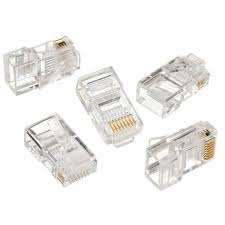
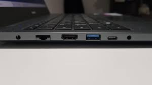
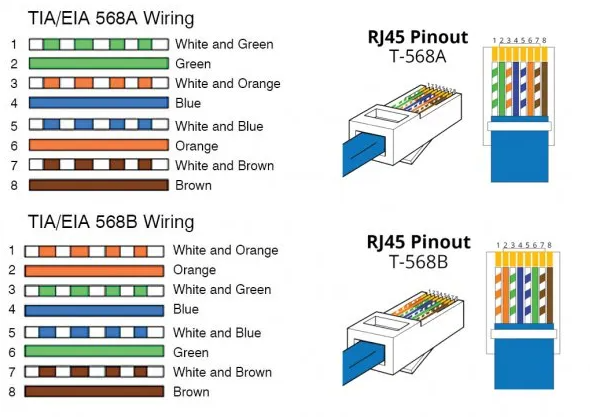
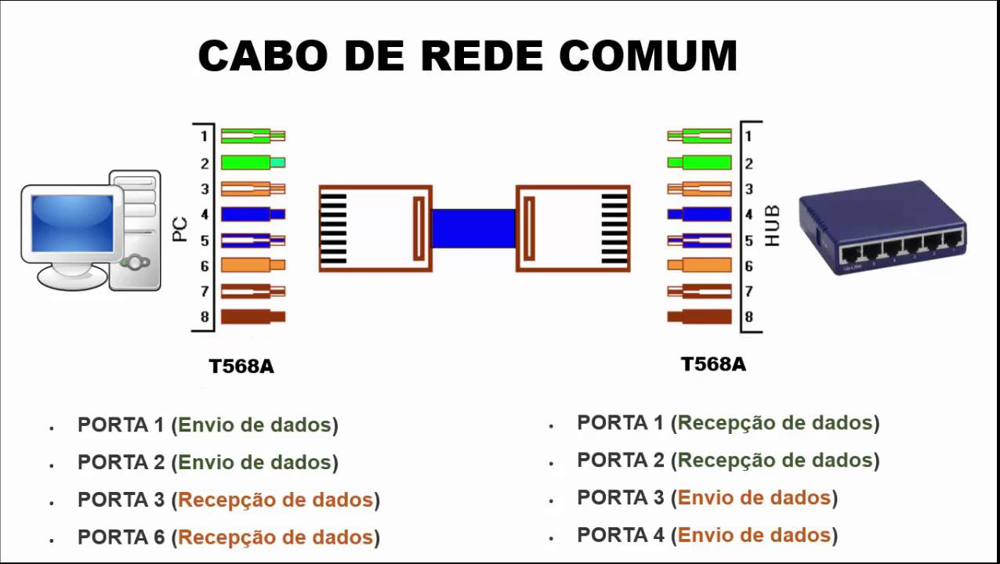
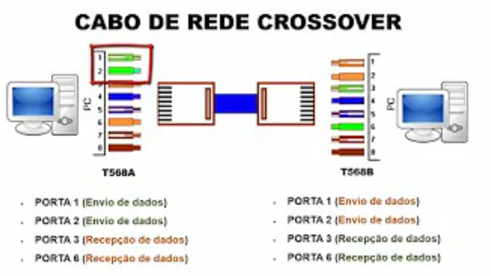
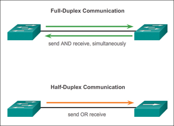

# fundamentos de LANs

Os padrões da camada física e da camada de enlace trabalham em conjunto para permitir que os computadores enviem bits uns para os outros através de um determinado tipo de mídia física de rede. 

A Camada física OSI (Camada 1) define como enviar fisicamente os bits através dessa mídia. A camada de enlace (Camada 2) define algumas regras sobre os dados que estão sendo transmitidos fisicamente, incluindo endereços que identificam o dispositivo remetente e o destinatário pretendido, e regras sobre quando um dispositivo poderá enviar (e quando deverá permanecer quieto), entre outras. Este capítulo explica alguns dos fundamentos das redes locais (LANs). 

O termo LAN refere-se a um conjunto de padrões das Camadas 1 e 2 elaborado para trabalhar em conjunto com o propósito de implementar redes geograficamente pequenas.

## Uma Visão Geral das LANs Ethernet Modernas

O termo Ethernet refere-se a uma família de padrões que, juntos, definem as camadas física e de enlace do tipo mais popular de LAN do mundo. Os diferentes padrões variam em termos de velocidade suportada, sendo as velocidades de 10 megabits por segundo (Mbps), 100 Mbps e 1000 Mbps (1 gigabit por segundo, ou Gbps) comuns hoje em dia. Os padrões também diferem no que diz respeito ao tipo de cabeamento e ao comprimento máximo permitido para os cabos. Por exemplo, os padrões Ethernet mais comumente utilizados permitem o uso do cabeamento de par-trançado não-blindado (unshielded twisted-pair, ou UTP), enquanto que outros padrões pedem um abeamento de fibra ótica, mais caro. 

O cabeamento de fibra ótica pode valer a pena em alguns casos, pois é mais seguro e permite distâncias muito maiores entre os dispositivos. Para dar suporte aos vários tipos de requerimentos presentados pela construção da LAN - requerimentos de velocidades diferentes, diferentes tipos de cabeamentm em que se busca um equilíbrio entre requerimentos de distância versus custo) e outros fatores - muitas variações de padrões Ethernet foram criadas.

O Instituto de Engenheiros Elétricos e Eletrônicos (Institute ofElectrical and Electronics Engineers, ou IEEE) já definiu muitos padrões Ethernet desde que assumiu o processo de padronização das LANs no começo dos anos 80. A maioria dos padrões define uma variação da Ethernet no nível da camada física, com diferenças em velocidade e tipos de cabeamento. Além disso, para a camada de enlace, o IEEE separa as funções em duas sub-camadas: 

* A sub-camada de Controle de Acesso à Mídia 802.3 (802.3 Media Access Control, ou MAC)
* A sub-camada de Controle de Enlace Lógico 802.2 (802.2 Logical Link Control, ou LLC) 

Na realidade, os endereços MAC recebem os seus nomes do nome IEEE para essa parte inferior dos padrões Ethernet para a camada de enlace.

Cada novo padrão de camada física criado pelo IEEE requer muitas diferenças na camada física. Entretanto, cada um desses padrões usa o mesmo cabeçalho 802.3, e usa também a sub-camada superior LLC.

A primeira subcamada, conhecida como protocolo IEEE 802.2 foi desenvolvida e adicionada ao modelo OSI com objetivo de melhorar a passagem das informações que vinham da camada de rede e eventualmente encontravam dificuldades de comunicação com as diversas tecnologias físicas existentes na camada de enlace. Mesmo o padrão Ethernet, em alguns casos, apresentava variações que justificavam a existência do LLC.

Por outro lado, a subcamada MAC, traz consigo a ligação mais direta com tecnologias físicas,  tais  como  ethernet  e  suas  variações.  Esta  subcamada  também  está  relacionada ao endereço físico dos dispositivos de rede, conhecido como MAC address. Um  mecanismo  de  correção  de  erros  existente  no  Frame  Ethernet,  atribui  alguma qualidade a esta camada para que os dados passem por alguma validação antes e após sua passagem pelos meios físicos. 

## Os Padrões Ethernet Originais: 10BASE2 e 10BASE5 

É mais fácil entender a Ethernet considerando-se primeiramente as duas especificações Ethernet iniciais, IOBASE5 e IOBASE2. 

Essas duas especificações Ethernet definiram os detalhes das camadas fisica e de enlace das primeiras redes Ethernet. (1OBASE2 e 1OBASE5 diferem nos seus detalhes de cabeamento, mas para a discussão deste capítulo, você pode considerar como se elas se comportassem de forma idêntica.) Com essas duas especificações, o engenheiro de rede instalava uma série de cabos coaxiais conectando cada dispositivo da rede Ethernet. Não havia hubs, switches e nem painéis de fiação. A Ethernet consistia unicamente das várias placas de rede instaladas nos computadores e do cabeamento coaxial. A série de cabos criava um circuito elétrico, chamado de bus, que era compartilhado entre todos os dispositivos da Ethernet. Quando um computador queria enviar alguns bits para outro computador do bus, enviava um sinal elétrico e a eletricidade se propagava para todos os dispositivos da Ethernet. 

A Figura mostra a lógica básica de uma antiga rede Ethernet 1OBASE2, usando um único bus elétrico, criada com cabos coaxiais e placas Ethernet. 

*A linha sólida representa um cabo coaxial*

As linhas sólidas da figura representam o cabeamento fisico da rede. As linhas pontilhadas com setas representam o caminho que o frame transmitido por pc1 toma. pc1 envia um sinal elétrico através da sua placa de rede Ethernet para o cabo e, tanto pc2 quanto pc3, recebem o sinal. O cabeamento cria um bus elétrico fisico, o que significa que o sinal transmitido é recebido por todas as estações da LAN. Assim como um ônibus ("bus") escolar pára na casa de cada estudante ao longo de uma rota, o sinal elétrico em uma rede 10BASE2 ou 10BASE5 é propagado para cada estação da LAN.

Devido ao fato de a rede usar um único bus, se dois ou mais sinais elétricos fossem mandados ao mesmo tempo, eles se encontrariam e colidiriam, tornando ambos os sinais ininteligíveis. Assim, não é de surpreender, a Ethernet também definiu uma especificação para garantir que apenas um dispositivo enviasse tráfego na Ethernet de cada vez. 

Caso contrário, a rede seria inútil. Esse algoritmo, conhecido como detecção de portadora para múltiplo acesso com detecção de colisão (carrier sense multiple access with collision detection, ou CSMA/CD), define a forma como o bus é acessado.

Em linguagem humana, o CSMA/CD é semelhante ao que acontece em uma reunião com muitas pessoas. É dificil
entender o que duas pessoas estão dizendo ao mesmo tempo, de forma que, em geral, uma pessoa fala e as demais ouvem. 

Imaginem que pc1 e pc2 queiram ambos responder aos comentários do orador atual. Assim que o orador faz
uma pausa para respirar, os dois tentam falar. Se pc1 ouve a voz de pc2 antes de conseguir articular um som, pc3 poderá parar e deixar pc2 falar. Ou talvez ambos comecem quase ao mesmo tempo, falando simultaneamente sem que ninguém consiga entender o que está sendo dito. Então acontece o familiar "Me desculpe, continue o que estava dizendo", e pc1 ou pc2 retoma sua fala. Ou talvez uma terceira pessoa apareça e comece a falar enquanto pc1 e pc2 estão baixando suas vozes. Essas "regras" dependem da cultura local; o CSMA/CD baseia-se nas especificações do protocolo Ethernet para atingir o mesmo tipo de objetivo. 

Basicamente, o algoritmo CSMA/CD pode ser resumido da seguinte forma: 

* Um dispositivo que queira enviar um frame esperará até que a LAN esteja em silêncio - em outras palavras, que nenhum frame esteja sendo enviado - antes de tentar enviar um sinal elétrico. 

Se uma colisão ainda ocorrer, os dispositivos que causaram a colisão esperam por um período de tempo aleatório e depois tentam novamente. 

Em LANs Ethernet 1OBASE5 e 1OBASE2, uma colisão ocorre porque o sinal elétrico transmitido viaja ao longo de todo o bus. Quando duas estações enviam sinais elétricos ao mesmo tempo, esses sinais se encontram, causando a colisão. Assim, todos os dispositivos de uma Ethernet 10BASE5 ou IOBASE2 precisam usar CSMA/CD para evitar colisões e para se recuperarem quando colisões inadvertidas ocorrerem. 

## Repetidores

Como qualquer tipo de LAN, 10BASE5 e IOBASE2 impunham limites sobre o comprimento total dos cabos. Com
1OBASE5, o limite era de 500m; com 10BASE2, era de 185m. Curiosamente, o 5 e o 2 dos nomes 10BASE5 e 10BASE2 representam a extensão máxima para os cabos - com o 2 referindo-se a 200 metros, o que chega bem perto do limite real, que é de 185 metros. (Ambos os tipos de Ethernet tinham velocidade de 10 Mbps.) 

Em alguns casos, a extensão máxima dos cabos não era suficiente, então um dispositivo chamado repetidor foi inventado.

Um dos problemas que limitavam o comprimento dos cabos era que o sinal enviado por um dispositivo poderia atenuarse demais caso o cabo fosse mais longo do que 500m ou 185m. Atenuação significa que quando sinais elétricos passam através de um fio, o sinal vai perdendo força à medida que viaja dentro do cabo. É o mesmo conceito pelo qual você pode ouvir uma pessoa falando ao seu lado, porém se essa pessoa falar no mesmo volume e você estiver do outro lado de uma sala cheia de gente, você talvez não a escute - pois as ondas sonoras foram atenuadas. 

Os repetidores se conectam a múltiplos segmentos de cabos, recebem o sinal elétrico em um cabo, interpretam os bits como 1s e Os e, então, geram um novo sinal, limpo e forte, para ser enviado através do outro cabo. Um repetidor não amplifica o sinal simplesmente, pois amplificar o sinal poderia fazer com que o ruído captado no caminho também se amplificasse. 

*Pelo fato de o repetidor não interpretar o que os bits significam, mas sim examinar e gerar sinais elétricos, considera-se que os repetidores operam no nível da Camada 1.*

Não espere que você vá precisar implementar LANs Ethernet lOBASE5 ou 10BASE2 hoje em dia. Entretanto, tenha em mente alguns pontos-chave desta seção ao passarmos para os conceitos relacionados às LANs modernas:

* As LANs Ethernet originais criavam um bus elétrico ao qual todos os dispositivos se conectavam. 

* Pelo fato de que colisões ocorriam nesse bus, a Ethernet definiu o algoritmo CSMA/CD, o qual definia uma forma tanto de evitar as colisões quanto de agir quando elas acontecessem. 

* Os repetidores estendiam o tamanho das LANs ao limpar o sinal elétrico e repeti-lo - uma função de Camada 1 - mas sem interpretar o significado do sinal elétrico. 

## Redes 10BASE-T com Hubs 

Posteriormente, o IEEE definiu novos padrões Ethernet além de IOBASE5 e 10BASE2. Cronologicamente, o padrão 1OBASE-T veio em seguida (1990), seguido pelo 100BASE-TX (1995) e depois pelo 1000BASE-T (1999). Para dar suporte a esses novos padrões, dispositivos de redes chamados hubs e switches foram também criados.  

1OBASE-T resolveu diversos problemas das especificações Ethernet 10BASE5 e 10BASE2 iniciais. 1OBASE-T permitiu o uso de cabeamento telefônico UTP que já estaria instalado. Mesmo que fosse necessário instalar um novo cabeamento, o UTP, barato e fácil de instalar, substituiria o cabeamento coaxial antigo, caro e difícil de instalar. 

Uma outra grande melhoria introduzida com 1OBASE-T, e que permanece uma questão-chave dos projetos ainda hoje, é o conceito de se cabear cada dispositivo a um ponto de conexão centralizado. Originalmente, 1OBASE-T pedia o uso de hubs Ethernet.

*A linha sólida representa um cabo de par trançado*

Ao montar uma LAN hoje em dia, você escolheria entre usar um hub ou switch como o dispositivo Ethernet centralizado ao qual todos os computadores se conectariam. Mesmo que as LANs Ethernet modernas usem switches em vez de hubs, entender a operação dos hubs lhe ajuda a entender parte da terminologia usada com os switches, bem como alguns dos seus benefícios. 

Os hubs são essencialmente repetidores com múltiplas portas fisicas. Isso significa que o hub simplesmente regenera o sinal elétrico que entra por uma porta e envia o mesmo sinal através de todas as outras portas. Ao fazer isso, qualquer LAN que usar um hub, como a figura acima, cria um bus elétrico, assim como 1OBASE2 e 1OBASE5. Portanto, ainda podem ocorrer colisões, de modo que as regras de acesso CSMA/CD continuaram a ser usadas. 

Redes 1OBASE-T usando hubs resolveram alguns grandes problemas com 1OBASE5 e 1OBASE2. Primeiramente, a
LAN passava a ter disponibilidade muito maior, pois na época das LANs 1OBASE5 e 1OBASE2, um problema com um único cabo podia fazer, e provavelmente fazia, a rede cair. Com 1OBASE-T, um cabo conecta cada dispositivo ao hub, de modo que um problema com um único cabo afeta apenas um dispositivo. Conforme mencionado anteriormente, o uso de cabeamento UTP, em uma topologia de estrela (todos os cabos indo para um dispositivo de conexão centralizado), diminuiu o custo de se adquirir e instalar o cabeamento. 

Hoje em dia, você ainda pode usar hubs ocasionalmente em LANs, mas é mais provável que use switches em vez de hubs. Os switches têm desempenho muito melhor do que os hubs, oferecem suporte a mais funções e normalmente custam quase o mesmo que os hubs. 

Entretanto, tenha em mente diversos pontos-chave sobre a história da Ethernet ao passarmos para os conceitos relacionados às LANs modernas: 

* As LANs Ethernet originais criavam um bus elétrico ao qual todos os dispositivos se conectavam. 

* Repetidores 1OBASE2 e 1OBASE5 ampliavam o tamanho das LANs limpando o sinal elétrico e repetindo-o - uma
função de Camada I - mas sem interpretar o significado do sinal elétrico. 

* Hubs são repetidores que fornecem um ponto de conexão centralizado para o cabeamento UTP - mas eles ainda compõem um único bus elétrico, compartilhado pelos vários dispositivos, assim como no caso de 1OBASE5 e 1OBASE2. 

* Pelo fato de que colisões podem ocorrer em qualquer um desses casos, a Ethernet definiu o algoritmo CSMA/CD que diz aos dispositivos como evitar colisões e que medidas tomar quando elas acontecem. 

## Cabeamento Ethernet UTP 

Os três padrões Ethernet mais comumente usados hoje em dia - 1OBASE-T (Ethernet), 1OOBASE-TX (Fast Ethernet, ou FE) e 1OOOBASE-T (Gigabit Ethernet, ou GE) - usam cabeamento UTP. Existem algumas diferenças importantes, particularmente no que se refere ao número de pares de fios necessários em cada caso e no tipo (categoria) de cabeamento. 

## Cabos UTP e Conectores RJ-45 

O cabeamento UTP usado por padrões Ethernet populares inclui ou dois ou quatro pares de fios. Devido ao fato de os fios dentro do cabo serem finos e frágeis, o cabo propriamente dito possui um revestimento externo de plástico flexível para apoiar os fios. 

Cada fio de cobre individual possui também um fino revestimento de plástico para evitar que o fio se quebre. O revestimento de cada fio tem uma cor diferente, facilitando assim a identificação dos terminais de um determinado fio em cada extremidade do cabo. 

As extremidades do cabo normalmente possuem algum tipo de conector instalado (geralmente conectores RJ-45) com os terminais dos fios inseridos nos conectores. O conector RJ-45 possui oito lugares fisicos específicos, nos quais os oito fios do cabo são inseridos, chamados de posições de pinos ou simplesmente pinos. Quando os conectores são adicionados à extremidade do cabo, os terminais dos fios devem ser inseridos nas posições dos pinos corretos.

Uma vez que o cabo possui conectores RJ-45 nas duas extremidades, o conector RJ-45 precisa ser inserido em um receptáculo RJ-45, freqüentemente chamado de porta RJ-45

*Conectores rj45*

*Placa de rede rj45*

*Placa de rede rj45 notebook*

## Transmitindo Dados Usando-se Pares Trançados 

o cabeamento UTP consiste de pares combinados de fios que são realmente trançados um com o outro - daí o nome par trançado. Os dispositivos em cada extremidade do cabo podem criar um circuito elétrico, usando um par de fios, simplesmente enviando corrente nos dois fios, em direções opostas. 

Quando alguma corrente atravessa qualquer fio, essa corrente induz um campo magnético fora do fio; o campo magnético, por sua vez, pode ocasionar ruído elétrico nos outros fios do cabo. Ao se trançar os fios do mesmo par, com a corrente viajando em direções opostas em cada fio, o campo magnético criado por um fio cancela quase totalmente o campo criado pelo outro. 

Devido a essa característica, a maioria dos cabos de rede que usa fios de cobre e eletricidade acaba usando pares trançados de fios para enviar dados. 

Para enviar dados através do circuito elétrico criado através de um par de fios, os dispositivos usam um esquema de codificação que define como o sinal elétrico deverá variar, ao longo do tempo, para significar ou O ou 1 binário. Por exemplo, 1OBASE-T usa um esquema que codifica um O binário como uma transição de voltagem mais alta para voltagem mais baixa, no curso de um intervalo de 1/1O,OOO,OOO-ésimo de segundo. Os detalhes elétricos da codificação não são importantes para os propósitos deste livro. 

Mas é importante perceber que os dispositivos de rede criam um circuito elétrico usando cada par de fios e variam o sinal conforme definido pelo esquema de codificação para enviar bits através do par de fios.

## Pinagem de Cabeamento UTP para 10BASE-T e 100BASE-TX 

Os fios do cabo UTP precisam ser conectados às posições de pinos corretas, no conector RJ-45, para que a comunicação funcione corretamente. Conforme mencionado anteriormente, o conector RJ-45 possui oito posições de pinos, ou simplesmente pinos, dentro dos quais os fios de cobre dentro do cabo se conectam. As pinagens dos fios - o mapeamento de quais fios, de quais cores, vão para quais posições de pinos - devem estar em conformidade com os padrões Ethernet.

Curiosamente, o IEEE não define realmente os padrões oficiais para fabricação de cabos, como também não define parte dos detalhes sobre as convenções usadas para as pinagens de cabos. Nos EUA, dois grupos industriais trabalhando em cooperação, a Associação da Indústria de Telecomunicações ( Telecommunications Industry Association, ou TIA) e a Aliança da Indústria de Eletrônicos (Electronics Industry Alliance, ou ElA), definem padrões para cabeamento UTP, códigos de cores para os fios e pinagens padrões para os cabos. (Consulte http://www.tiaonline.org e http://www.eia.org.)

Para montar uma LAN Ethernet funcional, você precisa escolher ou montar cabos que usem a pinagem correta em ambas as extremidades. A Ethernet 1OBASE-T e a 1OOBASE-TX definem que um par deve ser usado para enviar dados em uma direção e o outro na direção contrária. Em particular, as placas de rede Ethernet devem enviar dados usando o par conectado aos pinos 1 e 2 - em outras palavras, o par 3, de acordo com o padrão de pinagem T568A mostrado na acima. 

De forma semelhante, as placas de rede Ethernet devem esperar receber dados usando-se o par composto
pelos pinos 3 e 6 - o par 2, de acordo com o padrão T568A. Sabendo o que as placas de rede Ethernet fazem, os hubs e switches fazem o contrário - eles recebem no par formado pelos pinos 1,2 (par 3 da T568A) e enviam no par formado pelos pinos 3,6 (par 2 da T568A). 

## Conceito de Cabo Ethernet Direto

Um cabo Ethernet direto (ou "straight-through") conecta o fio do pino 1 de uma extremidade do cabo ao pino 1 da outra extremidade; o fio do pino 2 precisa se conectar ao pino 2 da outra extremidade do cabo; o pino 3 de uma extremidade se conecta ao pino 3 da outra; e assim por diante. (Para se criar um
cabo direto, ambas as extremidades do cabo usam o mesmo padrão de pinagem EIA/TIA.)

Um cabo direto é usado quando os dispositivos nas duas pontas do cabo usam pinos opostos ao transmitirem dados. Entretanto, ao se conectarem dois dispositivos que usam ambos os mesmos pinos para transmitir, as pinagens do cabo precisam ser configuradas para trocar o par de fios. 

Um cabo que troque os pares de fios internamente é chamado de cabo crossover. Por exemplo, muitas LANs dentro de uma rede Empresarial usam múltiplos switches, com um cabo UTP conectando os switches. Pelo fato de ambos os switches enviarem no par formado pelos pinos 3 e 6, e receberem no par 1 e 2, o cabo precisa trocar ou cruzar ("cross") os pares. 

## Conceito de Cabo Crossover para Ethernet

O pino 1 da esquerda se conecta ao pino 3 da direita, o pino 2 da esquerda ao pino 6 da direita, o pino 3 da esquerda ao pino 1 da direita e o pino 6 da esquerda ao pino 2 da direita. A parte de baixo da figura mostra que os fios dos pinos 3 e 6 em cada extremidade - os pinos que cada
switch usa para transmitir - conectam-se aos pinos 1 e 2 na outra extremidade, permitindo assim que os dispositivos recebam nos pinos 1 e 2. 

## Cabeamento 1000BASE-T 

Conforme mencionado anteriormente, 1OOOBASE-T difere de IOBASE-T e 1OOBASE-TX no que diz respeito ao
cabeamento e às pinagens. Primeiramente, 1OOOBASE-T requer quatro pares de fios. Além disso, a Ethernet Gigabit transmite e recebe em cada um dos quatro pares de fios simultaneamente.
Entretanto, a Ethernet Gigabit possui um conceito de cabos diretos e crossover, com uma pequena diferença nos crossover. As pinagens para um cabo direto são as mesmas - pino 1 para pino 1, pino 2 para pino 2, e assim por diante. O cabo crossover cruza o mesmo par de dois fios que o cabo crossover usado para outros tipos de Ethernet - o par dos pinos 1 e 2 e 3 e 6 - , e também cruza os dois outros pares (o par nos pinos 4 e 5 com o par nos pinos 7 e 8). 

## Aumentando a Largura de Banda Disponível Usando-se Switches 

A expressão domínio de colisão define o conjunto de dispositivos cujos frames poderiam colidir. Todos os dispositivos em uma rede 1OBASE2, 1OBASE5, ou qualquer rede usando um hub, correm o risco de ter colisões entre os frames que enviam, de modo que todos os dispositivos desses tipos de redes Ethernet encontram-se no mesmo domínio de colisão.

Para evitar colisões, e para se recuperar quando elas ocorrem, os dispositivos em um mesmo domínio de colisão usam CSMA/CD. 

Os switches LAN reduzem significativamente, ou até mesmo eliminam, o número de colisões em uma LAN. Ao contrário dos hubs, os switches não criam um único bus compartilhado, reencaminhando sinais elétricos através de todas as outras portas exceto aquela onde o sinal foi recebido. Em vez disso, os switches fazem o seguinte: 

* Os switches interpretam os bits no frame recebido para que possam enviar normalmente o frame através apenas da porta requerida, em vez de por todas as outras portas 

* Se um switch precisar encaminhar múltiplos frames através da mesma porta, o switch armazena os frames em
memória de buffer, enviando um de cada vez e evitando assim as colisões 

A sua lógica interna exige que o switch consulte o cabeçalho Ethernet, o que é considerado um recurso de
Camada 2. Como resultado, considera-se que os switches operam como dispositivos de Camada 2, enquanto que os hubs são dispositivos de Camada 1. 

Esses recursos aparentemente simples dos switches fornecem melhorias de desempenho significativas se comparadas com o uso de hubs. Em especial:

* Se apenas um dispositivo estiver cabeado a cada porta de um switch, é impossível acontecer colisões.

* Dispositivos conectados a uma porta do switch não compartilham a sua largura de banda com dispositivos conectados a outra porta do switch. Cada um possui a sua largura de banda separada, o que significa que um switch com portas de 100 Mbps possui 100 Mbps de largura de banda por porta. 

O segundo ponto refere-se aos conceitos por trás dos termos Ethernet compartilhada e Ethernet com switch. Conforme mencionado anteriormente, Ethernet compartilhada significa que a largura de banda da LAN é compartilhada entre os dispositivos da LAN, pois eles precisam aguardar a vez para usar a LAN, de acordo com o algoritmo CSMA/CD. 

A expressão Ethernet com switch refere-se ao fato de que, com switches, a largura de banda não precisa ser
compartilhada, permitindo um desempenho muito superior. Por exemplo, um hub com 24 dispositivos Ethernet de 100Mbps conectados permite um máximo teórico de 100 Mbps de largura de banda. Entretanto, um switch com 24 dispositivos Ethernet de 100 Mbps conectados oferece suporte a 100 Mbps para cada porta, ou teoricamente 2400 Mbps (2.4 Gbps) de largura de banda máxima. 

## Duplicando o Desempenho Através do Uso de Ethernet Full-Duplex 

Qualquer rede Ethernet que use hubs precisa que a lógica CSMA/CD opere corretamente. Entretanto, o CSMA/CD
impõe uma lógica half-duplex em cada dispositivo, o que significa que apenas um dispositivo pode enviar dados de cada vez. Pelo fato de os switches poderem armazenar frames em buffer, eles são capazes de eliminar completamente as colisões em portas do switch que se conectem a um único dispositivo. 

Como resultado, os switches LAN com apenas um dispositivo cabeado a cada porta permitem o uso de operação full-duplex. Full duplex significa que uma placa Ethernet pode enviar e receber simultaneamente. 

## Operação Full-Duplex Usando-se um Switch 

Com apenas o switch e um dispositivo conectados um ao outro, é impossível acontecerem colisões. Quando você implementa o full duplex, você desabilita a lógica CSMA/CD nos dispositivos das duas extremidades do cabo. Ao fazer isso, nenhum dos dispositivos sequer pensa mais em CSMA/CD e, portanto, pode enviar dados quando quiser. Como resultado, o desempenho da Ethernet nesse cabo foi duplicado ao se permitir transmissões simultâneas em ambas as direções. 

## Protocolos de Enlace para o padrão Ethernet 

Uma das qualidades mais significativas da família de protocolos Ethernet é que esses protocolos usam o mesmo pequeno conjunto de padrões de enlace. Por exemplo, o endereçamento Ethernet funciona da mesma forma em todas as variações da Ethernet, desde 1OBASE5 até a Ethernet de 1OGbps - incluindo padrões Ethernet que usam outros tipos de cabeamento que não o UTP. Além disso, o algoritmo CSMA/CD faz parte, tecnicamente, da camada de enlace, novamente aplicandose à maioria dos tipos de Ethernet, a não ser que tenha sido desabilitado. 

## Endereçamento Ethernet 

o endereçamento LAN Ethernet identifica ou dispositivos individuais ou grupos de dispositivos em uma LAN. Cada endereço possui 6 bytes, é geralmente escrito em hexadecimal e, em dispositivos Cisco, geralmente é escrito com pontos separando cada conjunto de quatro dígitos hexa. Por exemplo, OOOO.OCI2.3456 é um endereço Ethernet válido. 

Endereços Ethernet unicast identificam uma única placa LAN. (O termo unicast foi escolhido principalmente para contrastar com os termos broadcast, multicast e endereços de grupos.) 

Os computadores usam endereços unicast para identificar o remetente e o destinatário de um frame Ethernet. Por exemplo, imagine que Fred e Barney estejam na mesma Ethernet e que Fred envie um frame para Barney. Fred coloca o seu próprio endereço MAC Ethernet no cabeçalho Ethernet, como o endereço do remetente, e usa o endereço MAC de Barney como destinatário. Quando Barney recebe o frame, ele percebe que o endereço de destino é o seu próprio endereço, portanto processa o frame. Se Barney receber um frame com o endereço unicast de um outro dispositivo no campo de endereço do destinatário, ele simplesmente não processa o frame. 

O IEEE define o formato e a atribuição de endereços LAN. O IEEE requer endereços MAC unicast, globalmente
únicos, em todas as placas de interface LAN. (O IEEE os chama de endereços MAC porque protocolos MAC tais como o IEEE 802.3 definem os detalhes do endereçamento.) Para garantir um endereço MAC único, os fabricantes das placas Ethernet codificam o endereço MAC na placa, geralmente em um chip de ROM. A primeira metade do endereço identifica o fabricante da placa. Esse código, que é atribuído a cada fabricante pelo IEEE, é chamado de identificador organizacional único (organizationally unique identifier, ou OUI). Cada fabricante atribui um endereço MAC com o seu próprio OUI sendo a primeira metade do endereço e com a segunda metade recebendo um número que o fabricante jamais usou em outra placa.

Muitos termos podem ser usados para se descrever endereços LAN unicast. Cada placa de LAN vem com um endereço embutido (burned-in address, ou BIA), que é escrito no chip ROM da placa. Os BIAs são às vezes chamados de endereços universalmente administrados (universally administered addresses, ou UAA), pois o IEEE universalmente (bom, pelo menos mundialmente) administra a atribuição desses endereços. Independentemente do BIA ser usado ou de outro endereço ser configurado, muitas pessoas referem-se aos endereços unicast simplesmente como endereços LAN, endereços Ethernet, endereços de hardware, endereços físicos ou endereços MAC. 

## Framing Ethernet 

Framing define como uma string de números binários será interpretada. Em outras palavras, o framing define o significado por trás dos bits que são transmitidos através de uma rede. A camada física lhe ajuda a enviar uma string de bits de um dispositivo para outro. Quando o dispositivo destinatário recebe os bits, como eles devem ser interpretados? O termo framing refere-se à definição dos campos que supostamente estão presentes nos dados recebidos. 

Em outras palavras, o framing define o significado dos bits transmitidos e recebidos através de uma rede. 

## Formatos de Cabeçalhos para LANs

*IEEE 802.3 revisão de 1997*

| CAMPO                                   | EXTENSÃO DO CAMPO, EM BYTES | DESCRIÇÃO |
|-----------------------------------------|-----------------------------|---------------|
| Preâmbulo                               | 7                           |Sincronização|
| Delimitador de Início de Frame (SFD)    | 1                           | Indica que o byte seguinte inicia o campo MAC de Destino|
| Endereço MAC de destino                   | 6     |Identifica o destinatário pretendido
deste frame |
| Endereço MAC de origem               | 6    |Identifica o remetente deste frame                         
| Extensão                    | 2      |Define a extensão do campo de
dados do frame (ou a extensão ou o tipo está presente, mas não ambos) |
| Tipo                  | 2 |Define o tipo de protocolo listado
dentro do frame (ou a extensão ou o tipo está presente, mas não ambos) |
| Dados e Pad*                   | 46-1500  |Armazena dados de uma camada
superior, normalmente uma L3 PDU (genérica), e freqüentemente um pacote IP |
|Seqüência de Verificação de Frame (FCS) | 4 | Fornece um método para que a
placa de rede que esteja recebendo os dados determine se o frame passou por erros de transmissão|

A especificação IEEE 802.3 limita a parte de dados do frame 802.3 a um máximo de 1500 bytes. O campo Dados foi designado para armazenar pacotes de Camada 3; o termo unidade máxima de transmissão (maximum transmission unit, ou MTU) define o tamanho máximo do pacote de Camada 3 que pode ser enviado através de uma determinada mídia. Pelo fato de os pacotes de Camada 3 residirem dentro da parte de dados de um
frame Ethernet, 1500 bytes é o maior MTU lP permitido em uma Ethernet.

## Identificando os Dados dentro de um Frame Ethernet 

Através dos anos, muitos protocolos da camada de rede (Camada 3) diferentes foram elaborados. A maioria desses protocolos fazia parte de modelos de protocolos de rede maiores, criados por fabricantes para dar suporte aos seus produtos, tais como a SNA da IBM, o Novell NetWare, a DECnet da Digital Equipment Corporation e o AppleTalk da Apple Computers. Adicionalmente, os modelos OSI e TCP/IP também definiram protocolos da camada de rede. 

Todos esses protocolos de Camada 3, além de diversos outros, poderiam usar Etbemet. Para usar Ethernet, o protocolo da camada de rede colocaria o seu pacote (falando genericamente, o seu L3 PDU) dentro da parte de dados do frame Ethernet mostrado na Figura 3-14. Entretanto, quando um dispositivo recebe um frame Ethernet como esse, o dispositivo precisa saber qual tipo de L3 PDU encontra-se dentro do frame Ethernet. É um pacote IP? Um pacote OSI? SNA? E assim por diante. 

Para responder a essa pergunta, a maioria dos cabeçalhos de protocolos de enlace, incluindo a Ethernet, possui um campo com um código que define o tipo de cabeçalho de protocolo que segue. Falando genericamente, esses campos nos cabeçalhos de enlace são chamados de campos de Tipos. Por exemplo, para indicar que há um pacote IP dentro do frame Ethernet, o campo de Tipo teria um valor de 0800 hexadecimal (2048 decimal). Outros tipos de L3 PDUs seriam indicados usando-se um valor diferente no campo Tipo. 

Para se criar um campo Tipo para frames que usem o campo Tipo / Extensão como um campo Extensão, são adicionados um ou dois cabeçalhos após o cabeçalho Ethernet 802.3, mas antes do da Camada 3. Por exemplo, ao se enviar pacotes IP, o frame Ethernet possui dois cabeçalhos adicionais: 

* Um cabeçalho de Controle de Enlace Lógico (LLC) IEEE 802.2 

* Um cabeçalho de Protocolo de Acesso a Sub-rede (SNAP) IEEE 

## Detecção de Erros 

A última função da camada de enlace Ethernet explicada aqui é a detecção de erros. A detecção de erros é o processo de se descobrir se os bits de um frame se modificaram como resultado de terem sido enviados através da rede. Os bits poderiam se modificar por muitas pequenas razões, mas geralmente tais erros ocorrem como resultado de algum tipo de interferência elétrica. 

Como acontece com todos os protocolos de enlace, a Ethernet define um cabeçalho e um rodapé, com o rodapé contendo um campo usado para o propósito de detecção de erros.

O campo Seqüência de Verificação de Frame (Frame Cbeck Sequence, ou FCS) do rodapé Ethernet - o único campo desse rodapé - permite que o dispositivo que esteja recebendo o frame Ethernet detecte se os bits se modificaram durante a transmissão. 

Para detectar um erro, o dispositivo remetente calcula uma complexa função matemática, com o conteúdo do frame como input, colocando o resultado no campo FCS, de 4 bytes, do frame. O dispositivo destinatário faz o mesmo cálculo sobre o frame; se o seu cálculo bater com o campo FCS do frame, é sinal de que não ocorreram erros.

Se o resultado não bater com o campo FCS, significa que ocorreu um erro e o frame é descartado.
Repare que detecção de erros não significa recuperação de erros. A Ethernet define que o frame com erros deve ser descartado, porém não toma nenhuma atitude para fazer com que o frame seja retransmitido. Outros protocolos, notavelmente o TCP, podem perceber os dados perdidos e fazer com que seja executada a recuperação de erros. 