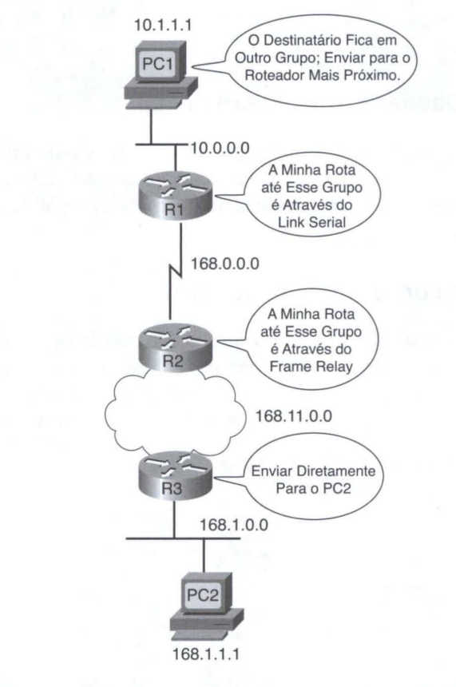
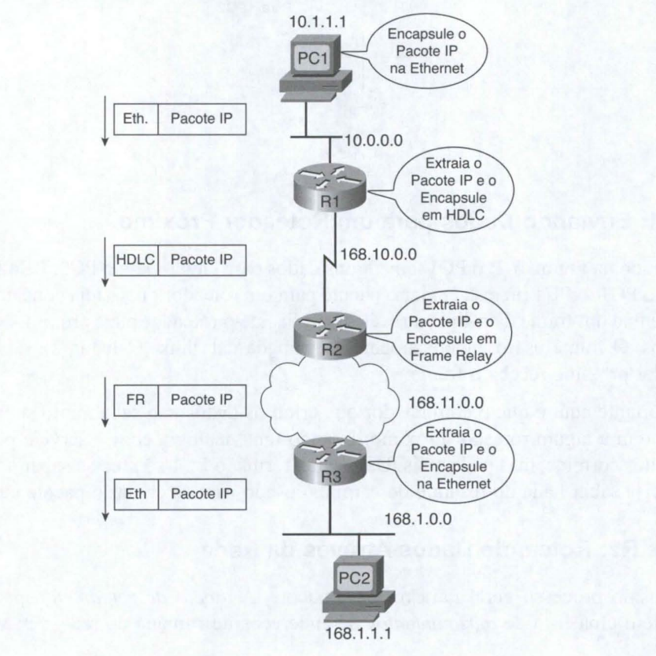
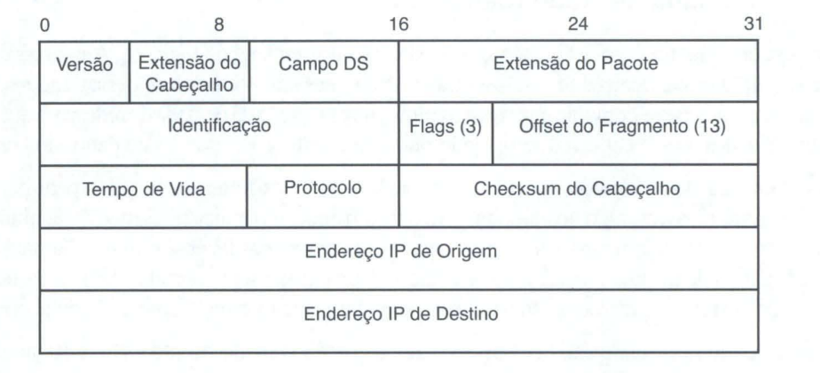
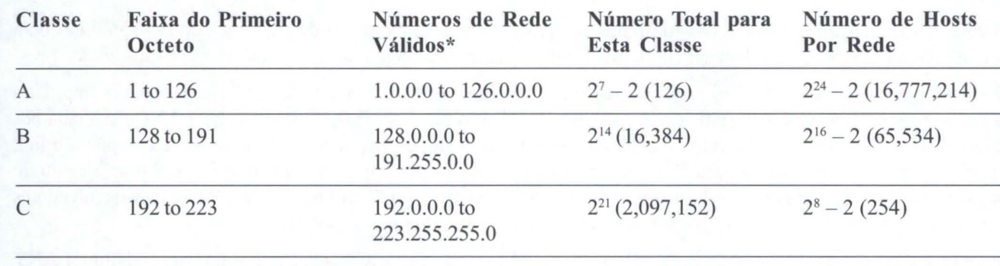
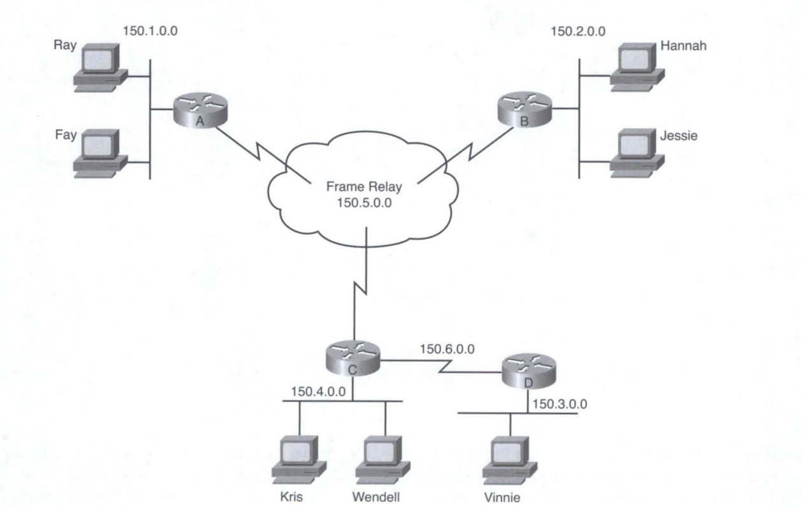

# Fundamentos de Endereçamento e Roteamento IP 

A camada fisica OSI (Camada 1) define a forma de se transmitir bits através de um determinado tipo de rede fisica. A camada data link OSI (Camada 2) define o framing, o endereçamento, a detecção de erros e as regras para quando se deve usar a mídia fisica. Embora sejam importantes, essas duas camadas não defmem a forma de se enviar dados entre dispositivos que estejam distantes uns dos outros, com muitas redes fisicas diferentes existindo entre os dois computadores.

Os protocolos equivalentes à camada OSI 3 definem a forma como os pacotes podem ser enviados do computador que cria o pacote até o computador que precisa receber o pacote. Para atingir esse objetivo, um protocolo da camada de rede OSI define as seguintes funcionalidades: 

* Roteamento: O processo de se encaminhar pacotes (PDUs de Camada 3).

* Endereçamento lógico: Endereços que podem ser usados independentemente do tipo de redes fisicas usadas, fornecendo a cada dispositivo (no mínimo) um endereço. O endereçamento lógico permite que o processo de roteamento identifique a origem e o destino de um pacote.

* Protocolo de roteamento: Um protocolo que auxilia os roteadores ao aprender dinamicamente sobre os grupos de endereços na rede, o que permite, por sua vez, que o processo de roteamento (encaminhamento) funcione bem.

* Outros utilitários: A camada de rede também se beneficia de outros utilitários. No caso do TCP/IP, esses utilitários incluem o Sistema de Nome de Domínio (Domain Name System, ou DNS), o Protocolo de Configuração de Host Dinâmico (Dynamic Host Configuration Protocol, ou DHCP), o Protocolo de Resolução de Endereços (Address Resolution Protocol, ou ARP) e o ping.

## Visão Geral das Funções da Camada de Rede 

A principal tarefa do IP é rotear dados (pacotes) do host de origem até o host de destino. Pelo fato de que a rede talvez precise enviar um grande número de pacotes, o processo de roteamento IP é bastante simples. 

O IP não exige qualquer contrato de overheads ou mensagens antes de enviar um pacote, o que o toma um protocolo do tipo sem conexão. O IP tenta enviar cada pacote, mas, se o processo IP de um roteador ou host não puder entregar o pacote, ele é descartado - sem recuperação de erros. O objetivo do IP é fazer as entregas com o mínimo de trabalho possível com cada pacote, o que permite o envio de pacotes de grandes volumes. Outros protocolos realizam algumas das outras funções de rede úteis. 

Por exemplo, o Protocolo de Controle de Transmissão (Transmission Control Protocol, ou TCP), fornece a recuperação de erros, reenviando dados perdidos, mas o IP não o faz.

## Roteamento (Encaminhamento) 

o roteamento concentra-se completamente na lógica de se encaminhar dados. A Figura mostra um simples exemplo de como o roteamento funciona. A lógica ilustrada pela figura é relativamente simples. Para que o PC1 envie dados para o PC2, ele precisa enviar algo para o roteador R1, o qual reenvia para o roteador R2 e, então, para o roteador R3, e finalmente para o PC2. Entretanto, a lógica usada por cada dispositivo do caminho varia ligeiramente. 

## A Lógica do PC1: Enviando Dados para um Roteador Próximo 

Neste exemplo, o PC1 tem alguns dados para enviar para o PC2. Pelo fato de o PC2 não estar na
mesma Ethemet que o PC1, o PC1 precisa enviar o pacote para um roteador que esteja conectado à mesma Ethemet que o PC1. O remetente envia um frame data-link, através da mídia, até o roteador mais próximo; esse frame inclui o pacote na sua parte de dados. 

O frame usa o endereçamento de camada data link (Camada 2), no cabeçalho data-link, para
garantir que o roteador próximo receba o frame. A questão mais importante aqui é que o computador que criou os dados não sabe muito sobre a rede - apenas como fazer os dados chegarem a algum roteador próximo. 

Usando uma analogia com o serviço postal, é como saber como chegar até a agência dos correios, mas nada mais. Da mesma forma, o PC1 só precisa saber como fazer o pacote chegar até R1, mas não precisa saber nada do restante do caminho usado para se enviar o pacote até o PC2. 

## A Lógica de R1 e R2: Roteando Dados Através da Rede 

R1 e R2 usam o mesmo processo geral para rotear o pacote. A tabela de roteamento para qualquer protocolo de camada de rede contém uma lista de agrupamentos de endereços de camada de rede. Em vez de uma só entrada na tabela de roteamento para cada endereço de destino individual, existe uma entrada na tabela para cada grupo. 

O roteador compara o endereço de destino no pacote com as entradas na tabela de roteamento e procura uma correspondência. A entrada correspondente na tabela de roteamento diz ao roteador para onde encaminhar o pacote em seguida. 

O conceito de agrupamentos de endereços da camada de rede é semelhante ao sistema de código de endereçamento postal (CEP) dos correios. Todas as pessoas que moram em uma mesma vizinhança estão no mesmo CEP, e os separadores nos correios simplesmente olham esses códigos, ignorando o restante do endereço. Da mesma forma, na figura acima, todos os computadores desta rede cujo endereço IP comece com 168.1 estão na Ethernet na qual o PC2 reside, de modo que os roteadores podem ter apenas uma entrada na tabela de roteamento que signifique "todos os endereços que comecem com 168.1."

Qualquer roteador ao longo do caminho repete o mesmo processo: o roteador compara o endereço de destino da camada de rede (Camada 3) do pacote aos grupos listados na tabela de roteamento, e a entrada correspondente na tabela de roteamento diz ao roteador em questão para onde encaminhar o pacote. No fim das contas, o pacote é entregue ao roteador conectado à rede ou sub-rede do host de destino (R3), conforme mostra a figura acima. 

## A Lógica de R3: Entregando Dados ao Destinatário Final 

O roteador final do caminho, R3, usa quase a mesma lógica que RI e R2, mas com uma pequena diferença. R3 precisa enviar o pacote diretamente para o PC2, e não para algum outro roteador. Superficialmente, essa diferença pode parecer insignificante. Posteriormente, o modo como a camada de rede usa a camada data link, o significado da diferença se tornará óbvio. 

## Interação da Camada de Rede com a Camada de Enlace 

Quando o protocolo da camada de rede está processando o pacote, ele decide enviar o pacote através da interface de rede apropriada. Antes que os bits propriamente ditos possam ser colocados nessa interface física, a camada de rede precisa repassar o pacote para os protocolos da camada data link, que, por sua vez, pedem à camada física para fazer o envio propriamente dito dos dados. A camada data link adiciona o cabeçalho e o rodapé apropriados ao pacote, criando um frame, antes de enviar os frames através de cada
rede fisica. 

O processo de roteamento envia o pacote, e somente o pacote, de um lado a outro da rede, descartando cabeçalhos e rodapés data-link ao longo do caminho. Os processos da camada de rede entregam o pacote ao destinatário final, usando sucessivos cabeçalhos e rodapés data-link apenas para fazer o pacote chegar até o próximo roteador ou host do caminho. Cada camada data link sucessiva apenas faz o pacote ir de um dispositivo até o próximo. 

Pelo fato de os roteadores construírem novos cabeçalhos e rodapés data-link (os rodapés não foram mostrados na figura), e pelo fato de os novos cabeçalhos conterem endereços data-link, os PCs e roteadores precisam ter alguma maneira de decidir quais endereços data-link usar. Um exemplo de como o roteador determina qual endereço data-link usar é o Protocolo de Resolução de Endereços IP (IP Address Resolution Protocol, ou ARP). O ARP é usado para se aprender dinamicamente o endereço data-link de um host IP conectado a uma LAN.

A cobertura do roteamento, até aqui, apresenta dois conceitos principais: 

* O processo de roteamento encaminha pacotes da Camada 3, também chamados de unidades de dados de protocolo de Camada 3 (PDU L3), baseado no endereço de destino, de Camada 3, no pacote. 

* O processo de roteamento usa a camada data link para encapsular os pacotes de Camada 3 em frames de Camada 2, para transmissão através de cada data link sucessivo. 

## Pacotes IP e o Cabeçalho IP 

| CAMPO                     | SIGNIFICADO        |
|-------------------------|---------------|
| Versão               | Versão do protocolo IP. A maioria das redes usa a versão 4 hoje em dia.      |
| IHL            | Extensão do Cabeçalho IP. Define o tamanho do cabeçalho IP, incluindo campos opcionais.      |
| Campo DS                   | Campo de Serviços Diferenciados. É usado para marcar pacotes com o propósito de se aplicar diferentes níveis de qualidade de serviço (quality-of-service, ou QoS) a diferentes pacotes.      |
| Extensão do pacote               | Identifica o tamanho completo do pacote IP, incluindo os dados.     |                        
| Identificação                    | Usado pelo processo de fragmentação do pacote IP; todos os fragmentos do pacote original contêm o mesmo identificador.       |
| Flags                  | 3 bits usados pelo processo de fragmentação do pacote IP. |
| Offset dos fragmentos                   | Um número usado para ajudar os hosts a reunirem os pacotes fragmentos, formando novamente o pacote original.  |
| TIL                  | Tempo de vida. Um valor usado para se prevenir loops de roteamento.  |
| Protocolo                  | Um campo que identifica o conteúdo da parte de dados do pacote IP. Por exemplo, o protocolo 6 indica que um cabeçalho TCP é a primeira coisa existente no campo de dados do pacote IP |
| Checksum do cabeçalho                   | Um valor usado para armazenar um valor FCS, cujo propósito é determinar se ocorreu qualquer erro de bits no cabeçalho IP.  |
| Endereço IP de origem                   | O endereço IP, de 32 bits, do remetente do pacote.  |
| Endereço IP de destino                  | O endereço IP, de 32 bits, do destinatário do pacote.  |

## Endereçamento da Camada de Rede (Camada 3) 

Os protocolos da camada de rede definem o formato e o significado dos endereços lógicos. (A expressão endereço lógico na verdade não se refere ao fato de os endereços fazerem sentido ou não, mas sim ao contraste desses endereços com os endereços fisicos.) Cada computador que precise se comunicar terá (no mínimo) um endereço da camada de rede, para que outros computadores possam enviar pacotes de dados a esse endereço, esperando que a rede entregue o pacote de dados ao computador correto. 

Uma característica fundamental dos endereços da camada de rede é que eles foram elaborados para permitir o agrupamento lógico de endereços. Em outras palavras, algo no valor numérico de um endereço indica um grupo ou conjunto de endereço, todos os quais são considerados como estando no mesmo agrupamento. Com endereços IP, esse grupo é chamado de rede ou sub-rede.

Esses agrupamentos funcionam da mesma forma como os códigos de endereçamento postal (CEP) do correio, permitindo que os roteadores (separadores do correio) rapidamente encaminhem (separem) uma grande quantidade de pacotes (cartas).

Da mesma forma como ocorre com endereços postais, os endereços da camada de rede são agrupados com base em uma localidade fisica em uma rede. As regras são diferentes para alguns protocolos, mas, no caso do endereçamento IP, a primeira parte do endereço IP é a mesma para todos os endereços de um agrupamento. 

O roteamento baseia-se no fato de que os endereços de Camada 3 são agrupados. As tabelas de roteamento para cada protocolo de camada de rede só podem ter uma entrada para o grupo, e não uma entrada para cada endereço individual. 

Imagine uma Ethernet com 100 hosts TCP/IP. Um roteador que precise encaminhar pacotes a qualquer um desses hosts precisa de apenas uma entrada na sua tabela de roteamento IP, com essa entrada única representando todo o grupo de hosts da Ethernet. Esse fato básico é uma das principais razões pelas quais os roteadores permitem escalabilidade até centenas de milhares de dispositivos. 

Funciona de modo bastante semelhante ao sistema de código de endereçamento postal. Seria absurdo fazer com que pessoas que moram longe umas das outras estivessem no mesmo CEP, ou vizinhos em CEPs diferentes. O coitado do carteiro gastaria todo o seu tempo dirigindo e voando de um lado para outro do país! De forma semelhante, para tornar o roteamento mais eficiente, os protocolos da camada de rede agrupam os endereços. 

## Protocolos de Roteamento 

Para fazer as escolhas corretas, cada roteador precisa de uma tabela de roteamento com uma rota apropriada para enviar o pacote até o PC2. As rotas dizem ao roteador para onde enviar o pacote em seguida. 

Na maioria dos casos, os roteadores criam as entradas das suas tabelas de roteamento dinamicamente, usando um protocolo de roteamento. Os protocolos de roteamento aprendem sobre todas as localidades dos "grupos" da camada de rede de uma determinada rede e anunciam as localidades desses grupos. Como resultado, cada roteador é capaz de construir dinamicamente uma tabela de roteamento válida. Os protocolos de roteamento definem formatos de mensagens e procedimentos, assim como qualquer outro protocolo. 

O objetivo final de cada protocolo de roteamento é preencher a tabela com todos os grupos de destinatários conhecidos e com a melhor rota para se atingir cada grupo. 

## Definições do Endereçamento IP 

Se um dispositivo deseja se comunicar usando o TCP/IP, ele precisa de um endereço IP. Quando o dispositivo possui um endereço IP e o software e hardware apropriados, ele é capaz de enviar e receber pacotes IP. Qualquer dispositivo capaz de enviar e receber pacotes IP é chamado de host IP. 

Os endereços IP consistem de um número de 32 bits, geralmente escrito em notação decimal pontuada. A parte
"decimal" dessa expressão se deve ao fato de que cada byte (8 bits) do endereço IP de 32 bits é mostrado como o seu equivalente decimal. 

Os quatro números decimais resultantes são escritos em seqüência, com "pontos", ou pontos decimais, separando-os - daí o nome decimal pontuado. Por exemplo, 168.1.1.1 é um endereço IP escrito em forma decimal pontuada; a versão binária real é 101O1000 00000001 00000001 00000001.

Cada número decimal em um endereço IP é chamado de octeto. O termo octeto é apenas uma versão neutra do termo byte. Assim, para um endereço IP 168.1.1.1, o primeiro octeto é 168, o segundo octeto é 1, e assim por diante. A faixa de números decimais em cada octeto vai de O a 255, inclusive. 

Finalmente, note que cada interface de rede usa um endereço IP único. A maioria das pessoas tende a pensar que o seu computador possui um endereço IP, mas na verdade é a placa de rede instalada no computador que tem um endereço IP. 

Se você colocar duas placas Ethernet em um PC, para encaminhar pacotes IP através das duas, cada uma irá precisar de um endereço IP único. Além disso, se o seu laptop tiver tanto uma placa Ethernet quanto uma conexão wireless funcionando ao mesmo tempo, o seu laptop terá um endereço IP para cada NIC. De forma semelhante, os roteadores, que normalmente têm muitas interfaces de rede que encaminham pacotes IP, possuem um endereço IP para cada interface. 

## Classes de Redes 

A RFC 791 defrne o protocolo IP, incluindo diversas classes diferentes de redes. O IP define três classes diferentes de redes para endereços usados por hosts individuais - endereços chamados de endereços IP unicast. Essas três classes de redes são chamadas de A, B e C. O TCP/IP define também endereços de Classe D (multicast) e de Classe E ( experimental). 

Por definição, todos os endereços na mesma rede Classe A, B ou C têm o mesmo valor numérico para a parte de rede dos endereços. O restante do endereço é chamado de parte do host do endereço. 

As redes Classe A, B e C têm diferentes extensões para a parte que identifica a rede: 

* As redes Classe A possuem uma parte de rede com 1 byte. Com isso, restam 3 bytes para o restante do endereço, chamado de parte do bost.

* As redes Classe B possuem uma parte de rede com 2 bytes, restando 2 bytes para a parte do bost do endereço.

* As redes Classe C possuem uma parte de rede com 3 bytes, restando apenas 1 byte para a parte do host. 

## Os Reais Números de Rede de Classe A, B e C 

A Internet é urna coleção de quase todas as redes baseadas em IP e quase todos os computadores hosts TCPIIP do mundo. O projeto original da Internet demandou diversos recursos cooperativos, o que a tomou tecnicamente possível e administrativamente gerenciável:

* Cada computador conectado à Internet precisa ter um endereço IP único e não-duplicável.

* Administrativamente, uma autoridade central atribui redes de Classe A, B ou C para empresas, órgãos governamentais, sistemas escolares e provedores de acesso com base no tamanho das suas redes IP (Classe A para grandes redes, Classe B para redes médias e Classe C para pequenas redes).

* A autoridade central atribui cada número de rede para apenas uma organização, ajudando a garantir a atribuição de endereços únicos para todo o mundo.

* Cada organização com uma rede Classe A, B ou C atribui, então, endereços IP dentro da sua própria rede. 

Seguindo essas orientações, desde que cada organização atribua cada endereço IP para apenas um computador, cada computador na Internet terá um endereço IP globalmente único.

A organização responsável pela atribuição universal de endereços IP é a Corporação Internet para Atribuição de Números de Rede (Internet Corporation for Assigned Network Numbers, ou ICANN, www.icann.org). (Anteriormente, o processo de atribuição de endereços IP era responsabilidade da Autoridade de Atribuição de Números Internet - a Internet Assigned Numbers Authority, ou !ANA) A ICANN, por sua vez, atribui autoridade regional para outras organizações cooperadoras. 

Por exemplo, o Registro Americano para Números Internet (American Registry for Internet Numbers, ou ARIN, www.arin.org) se encarrega do processo de atribuição de endereços para a América do Norte. 

## Sub-Redes IP 

O uso de sub-redes significa que uma subdivisão de uma mesma rede Classe A, B ou C será tratada como se essa subdivisão fosse uma rede propriamente dita. Na verdade, o nome "subnet" é originalmente uma abreviatura de "subdivided network" ou "rede sub-dividida". 

## Roteamento do Host 

Os hosts na verdade usam uma lógica de roteamento simples para decidirem aonde enviar um pacote. Essa lógica, com dois passos, é a seguinte:

1. Se o endereço IP de destino estiver na mesma sub-rede que eu, envie o pacote diretamente para esse
host de destino.

2. Se o endereço IP de destino não estiver na mesma sub-rede que eu, envie o pacote para o meu gateway
padrão (a interface Ethernet de um roteador na sub-rede). 

## Decisões de Encaminhamento do Roteador e a Tabela de Roteamento IP 

o roteador usa a seguinte lógica ao receber um frame data-link - um frame que tenha um pacote IP encapsulado nele:

1. Usar o campo data-link FCS para garantir que o frame não contém erros; se forem detectados
erros, descartar o frame.

2. Assumindo-se que o frame não foi descartado no passo 1, descartar o cabeçalho e rodapé data-link, deixando apenas o pacote IP.

3. Comparar o endereço IP de destino do pacote com a tabela de roteamento e descobrir a rota que bate com
o endereço de destino. Essa rota identifica a interface de saída do roteador e possivelmente o roteador do salto seguinte.

4. Encapsular o pacote IP dentro de um novo cabeçalho e rodapé data-link, apropriados para a interface de
saída, e encaminhar o frame.

Com esses passos, cada roteador envia o pacote para a localidade seguinte, até que o pacote chegue ao seu destino final. 

## Protocolos de Roteamento IP 

O processo de roteamento (encaminhamento) depende largamente da existência de uma tabela de roteamento IP precisa e atualizada em cada roteador. Os protocolos de roteamento IP preenchem as tabelas dos roteadores com rotas válidas e livres de loops. Cada rota inclui um número de sub-rede, a interface através da qual os pacotes serão enviados para serem entregues à sub-rede em questão, e o endereço IP do próximo roteador que deverá receber pacotes destinados a essa sub-rede (se necessário).

Os objetivos descritos na lista abaixo são comuns a qualquer protocolo de roteamento IP,
independentemente do seu tipo de lógica subjacente:

* Aprender e preencher dinamicamente a tabela de roteamento com rotas para todas as sub-redes da rede.

* Se estiver disponível mais de uma rota para uma sub-rede, colocar a melhor rota na tabela de roteamento. 

* Perceber quando as rotas na tabela de roteamento não forem mais válidas e removê-Ias da tabela.

* Se uma rota for removida da tabela, e estiver disponível uma outra rota através de um roteador vizinho, adicionar esta rota à tabela. (Muitas pessoas consideram este objetivo e o anterior como sendo um só.)

* Adicionar novas rotas, ou substituir rotas perdidas pela melhor rota atualmente disponível, o mais rapidamente possível. O tempo entre se perder a rota e se achar uma substituta é chamado de tempo de convergência.

* Prevenir loops de roteamento. 
Os protocolos de roteamento podem ficar bem complicados, mas a lógica básica que usam é relativamente simples. Para anunciar rotas em urna rede, os protocolos de roteamento seguem estes passos gerais: 

1. Cada roteador adiciona uma rota à sua tabela de roteamento, para cada sub-rede conectada diretamente ao
roteador.

2. Cada roteador informa aos seus vizinhos sobre todas as rotas na sua tabela de roteamento, incluindo as rotas diretamente conectadas e aquelas aprendidas a partir de outros roteadores.

3. Após aprender uma nova rota a partir de um vizinho, o roteador a adiciona à sua tabela de roteamento, com o roteador do salto seguinte sendo, geralmente, o vizinho a partir do qual a rota foi aprendida. 

