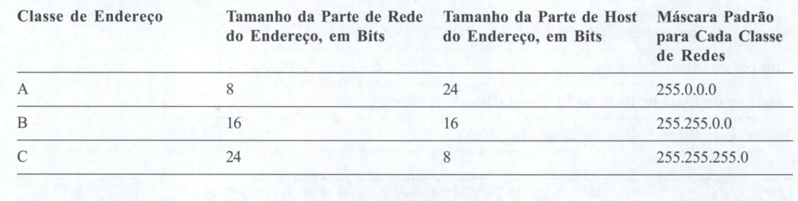
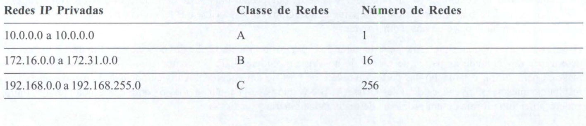

# Endereçamentos e sub redes ip

Por definição, um endereço IP que comece com 8 no primeiro octeto é uma rede de Classe A, de modo que a parte de rede do endereço é o primeiro byte, ou primeiro octeto. Um endereço que comece com 130 é uma rede Classe B. 

Por definição, os endereços de Classe B têm uma parte de rede com 2 bytes, como mostrado. Finalmente, qualquer endereço que comece com 199 encontra-se em uma rede Classe C, que possui uma parte de rede com 3 bytes. 

Também por definição, um endereço de Classe A tem uma parte de host com 3 bytes, a Classe B tem uma parte de host com 2 bytes e a Classe C tem uma parte de host com 1 byte.

Os computadores, usam uma máscara para definir o tamanho das partes de rede e de host de um endereço. A lógica por trás do uso das máscaras resulta nas mesmas convenções de redes Classe A, B e C que você já conhece, mas o computador lida melhor com o endereçamento na forma de um problema de matemática binária.

A máscara é um número binário de 32 bits, geralmente escrito em formato decimal pontuado. O propósito da máscara é definir a estrutura de um endereço IP. Resumindo, a máscara define o tamanho da parte de host de um endereço IP, representando a parte de host do endereço IP com Os binários. A primeira parte da máscara contém 1s binários, o que representa a parte de rede dos endereços se não forem usadas sub-redes, ou caso contrário, as partes de rede e de sub-rede dos endereços.

Quando não são usadas sub-redes, cada classe de endereços IP usa a máscara padrão para a classe. Por exemplo, a máscara padrão para a Classe A termina com 24 bits de Os binários, o que significa que os três últimos octetos da máscara são Os, representando a parte de host, com 3 bytes, dos endereços Classe A. 

A Tabela abaixo resume as máscaras padrões e reflete os tamanhos das duas partes de um endereço IP.

## Endereçamento Público e Privado

O ICANN (anteriormente IANA) e as suas organizações-membros gerenciam o processo de se atribuir números de
rede IP, ou mesmo faixas menores de endereços IP, para companhias que desejem se conectar à Internet. Após a companhia receber uma faixa de endereços IP, somente essa empresa pode usar essa faixa. Além disso, os roteadores na Internet podem então aprender rotas para atingir essas redes, de modo que qualquer pessoa na Internet possa encaminhar pacotes para essa rede IP. 

Pelo fato de esses endereços IP poderem ser atingidos por pacotes originários da Internet pública, essas redes são freqüentemente chamadas de redes púbücas, e os seus endereços são chamados de endereços públicos.

Alguns computadores nunca se conectarão à Internet. Assim, os engenheiros que estejam construindo uma rede que consiste apenas desse tipo de computadores poderiam usar endereços IP iguais a endereços já registrados publicamente na Internet. Assim, ao elaborar a convenção de endereçamento IP para uma rede desse tipo, a empresa poderia escolher e usar quaisquer números de redes que quisesse, e tudo funcionaria bem. 

Por exemplo, você pode comprar alguns roteadores, conectá-los no seu escritório, configurar endereços IP na rede 1.0.0.0 e tudo funcionará, mesmo que alguma outra empresa também use a rede Classe A como a sua rede IP publicamente registrada. Os endereços IP que você usa podem ser duplicatas de endereços IP reais na Internet, mas se o seu objetivo for somente criar um laboratório de estudo
no seu escritório, tudo funcionará bem.

No entanto, usar os mesmos endereços IP que outra empresa é desnecessário nesta situação, porque o TCPIIP RFC1918 define um conjunto de redes privadas que pode ser usado para internetworks que não se conectem à Internet.

Mais importante ainda, esse conjunto de redes privadas nunca será atribuído pelo ICANN a nenhuma organização para uso como números de redes públicas registradas. Assim, ao criar uma rede privada, como por exemplo, em um laboratório, você pode usar números em uma faixa que não estará sendo usada por ninguém na Internet pública. A Tabela abaixo mostra o espaço de endereços privados definido pela RFC 1918.

Em outras palavras, qualquer empresa pode usar esses números de redes. Entretanto, nenhuma tem a permissão para anunciar essas redes usando um protocolo de roteamento na Internet.

)corre que as redes privadas podem ser usadas dentro de um empresa e essa empresa pode ainda se conectar à Internet, usando uma função chamada Tradução de Endereços de Rede (Network Address Translation, ou NAT).

## Revisão das Sub-redes IP

As sub-redes IP criam grandes números de grupos menores de endereços IP, em comparação com o simples uso de convenções de Classe A, B e C. Você ainda pode pensar em termos das regras de Classes A, B e C, mas agora uma mesma rede Classe A, B ou C pode ser subdividida em muitos grupos menores. O conceito de sub-rede trata uma subdivisão de uma mesma rede Classe A, B ou C como se fosse ela mesma uma rede. Ao se fazer isso, uma mesma rede Classe A, B ou C pode ser subdividida em muitas sub-redes não-sobrepostas.

## Revisão do Roteamento IP

O roteamento e o endereçamento IP foram elaborados cada um com o outro em mente. O roteamento IP presume a
estrutura das sub-redes IP, na qual faixas de endereços IP consecutivos residem em uma mesma sub-rede. Os RFCs referentes ao endereçamento IP definem as sub-redes de forma tal que endereços IP numerados consecutivamente podem ser representados como um número ( endereço) de sub-rede e uma máscara de sub-rede. 

Isso permite aos roteadores listar de forma sucinta as sub-redes nas suas tabelas de roteamento.

## Operações Matemáticas Usadas com as Sub-redes

Os computadores, e especialmente os roteadores, pensam nos endereços IP em termos de números binários de 32 bits.

Isso é bom, pois tecnicamente é isso o que os endereços IP são. Além disso, os computadores usam uma máscara de sub-rede para definir a estrutura desses endereços IP binários.

## Convertendo Endereços e Máscaras IP de Decimal para Binário e Vice-Versa

Os endereços IP são números binários de 32 bits escritos como uma série de números decimais separados por pontos (o chamado formato decimal pontuado). Para examinar um endereço na sua forma real, a forma binária, você precisa converter de decimal para binário. Para colocar um número binário de 32 bits no formato decimal necessário quando se configura um roteador, você precisa converter o número de 32 bits de volta para decimal, 8 bits de cada vez.

Uma chave para o processo de conversão para endereços IP é lembrar-se destes fatos:

* Quando você converte de um formato para outro, cada número decimal representa 8 bits.

* Quando você converte de decimal para binário, cada número decimal se converte em um número de 8 bits.

* Quando você converte de binário para decimal, cada conjunto de 8 bits consecutivos se converte em um número decimal.

Considere a conversão do endereço IP 150.150.2.1 para binário. O número 150, quando convertido para o seu equivalente de 8 bits, é 10010110. O byte seguinte, um outro 150 decimal, é convertido em 10010110. o terceiro byte, 2 decimal, é convertido em 00000010. Finalmente o quarto byte, 1 decimal, é convertido em 00000001. 

A série combinada de números de 8 bits é o endereço IP de 32 bits - neste caso, 10010 11 O 10010 11 000000010 00000001.

Começando com a versão binária do endereço IP, você primeiramente o separa em quatro conjuntos de oito dígitos. Em seguida, você converte cada conjunto de oito dígitos binários para o seu equivalente decimal. Por exemplo, escrever um endereço IP da seguinte forma é correto, mas não é muito útil:

10010110100101100000001000000001

Para converter este número em um formato decimal mais conveniente, primeiramente divida-o em quatro conjuntos de oito digitos:

10010110 10010110 00000010 00000001

O primeiro número de 8 bits se converte em 150, assim como o segundo. O terceiro conjunto de 8 bits se converte em 2, e o quarto se converte em 1, resultando em 150.150.2.1.

Tenha em mente que, quando você usa sub-redes, as partes da sub-rede e do host do endereço poderão compreender apenas parte de um byte do endereço IP. Porém, quando você converte de binário para decimal e de decimal para binário, a regra de sempre converter um número binário de 8 bits em um número decimal é sempre verdadeira. Entretanto, ao pensar nas sub-redes, você precisa ignorar as fronteiras entre os bytes e pensar nos endereços IP como números de 32 bits, sem fronteiras específicas entre os bytes.

## Notação com Prefixo / Notação CIDR

As máscaras de sub-redes são na realidade números de 32 bits, mas, para maior conveniência, eles geralmente são escritos como números decimais pontuados - por exemplo, 255.255.0.0. Entretanto, uma outra maneira de se representar uma máscara, chamada de notação com prefixo, e às vezes chamada de notação CIDR, propicia uma forma ainda mais sucinta de escrever, digitar ou dizer o valor de uma máscara de sub-rede. Para entender a notação com prefixo, é importante saber que todas as máscaras de sub-redes têm um certo número de 1s binários consecutivos, seguidos de Os binários. Em outras palavras, uma máscara de sub-rede não pode ter 1 s e Os espalhados. A máscara sempre tem um certo número de 1 s binário, seguidos apenas de Os binários.

Para o propósito de escrever ou digitar a máscara de sub-rede, a notação com prefixo simplesmente indica o número de 1s binários da máscara, precedido de uma barra. Por exemplo, para a máscara de sub-rede 255.255.255.0, cujo equivalente binário é 11111111 11111111 11111111 00000000, a notação com prefixo equivalente é /24, porque há 24 1 s binários consecutivos na máscara.

Ao falar sobre sub-redes, você pode dizer coisas como "Essa sub-rede usa um prefIXO barra 24" ou "Essa sub-rede tem um prefixo de 24 bits", em vez de dizer algo como "Essa sub-rede usa uma máscara de duzentos e cinqüenta e cinco ponto duzentos e cinqüenta e cinco ponto duzentos e cinqüenta e cinco ponto zero". Como você pode ver, a alternativa da notação com prefixo - simplesmente dizer algo como "barra vinte e quatro" - é muito mais fácil.

## material de suporte

[ipcalc](https://jodies.de/ipcalc)
