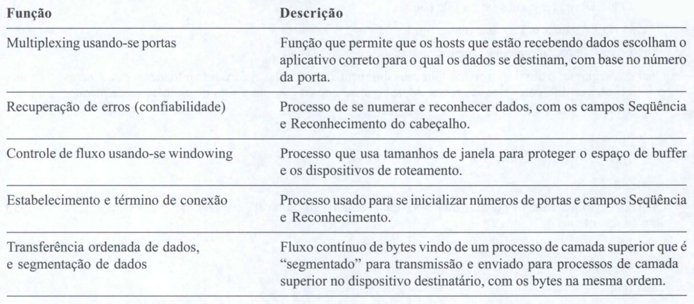
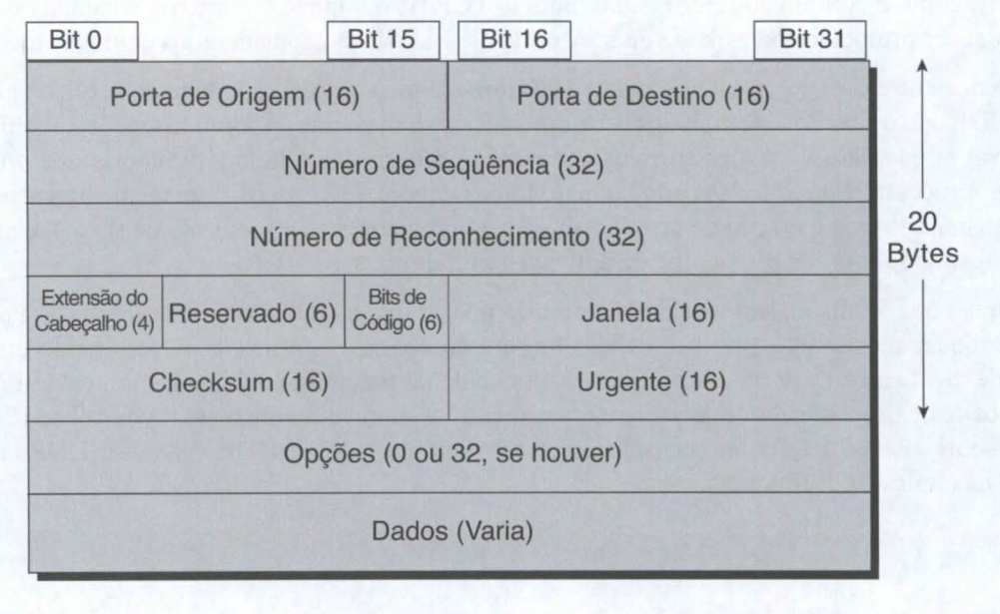
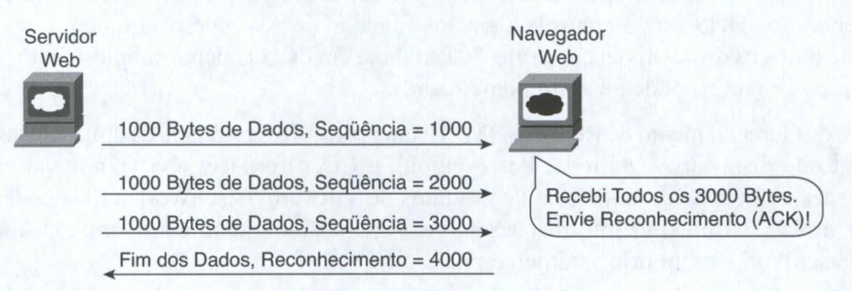
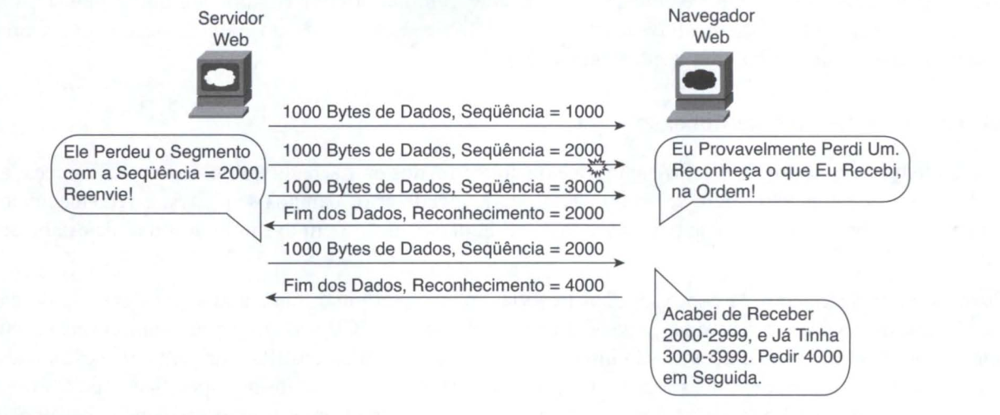
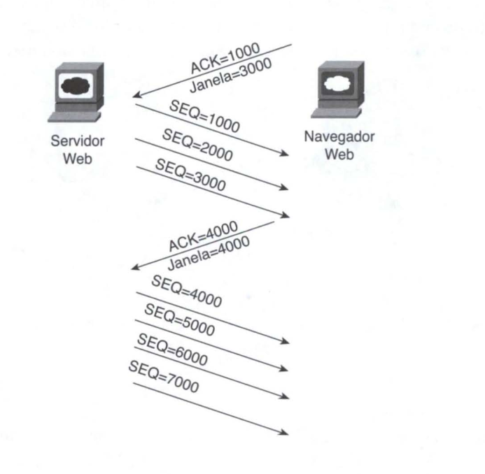
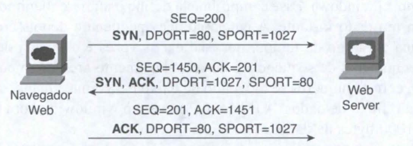
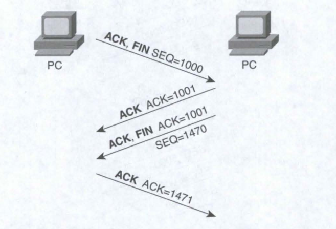
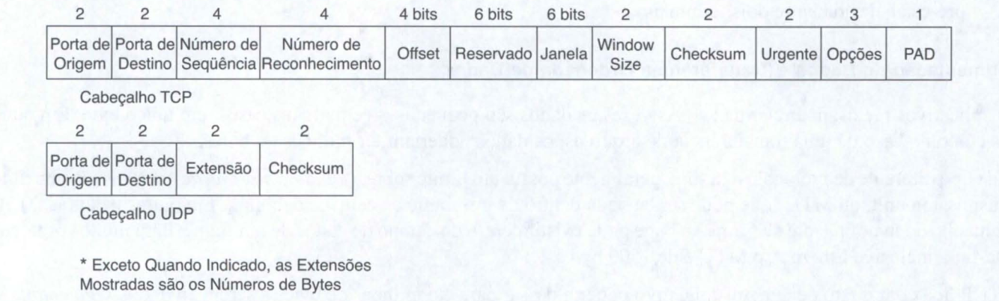

# Fundamentos de transporte, aplicações e segurança tcp/ip

## Protocolos TCP/IP da Camada 4: TCP e UOP

A camada de transporte OSI (Camada 4) define diversas funções , sendo as mais importantes a recuperação de erros e o controle de fluxo. De forma semelhante, os protocolos da camada de transporte TCP/IP também implementam esses mesmos tipos de recursos. Repare que tanto o modelo OSI quanto o modelo TCP/IP chamam essa camada de camada de transporte. Mas, como é comum ao referir-se ao modelo TCP/IP, o nome e o número da camada baseiam-se no OSI, de modo que quaisquer protocolos da camada de transporte do TCP/IP são considerados como protocolos de Camada 4.

A principal diferença entre o TCP e o UDP é que o TCP fornece uma ampla variedade de serviços para os aplicativos, enquanto que o UDP não o faz. Por exemplo, os roteadores descartam pacotes por muitas razões, incluindo erros de bits, congestão e casos em que não se conhecem rotas corretas.

A maioria dos protocolos data-link percebe erros (um processo chamado detecção de erros), mas depois descarta os frames que apresentam erros. O TCP possibilita a retransmissão (recuperação de erros) e ajuda a evitar a congestão (controle de fluxo) , enquanto que o UDP não o faz . Como resultado, muitos protocolos de aplicação preferem usar o TCP.

Entretanto, não deixe que a falta de serviços do UDP o faça pensar que o UDP é pior do que o TCP. Por fornecer poucos serviços, o UDP requer menos bytes no seu cabeçalho, em comparação com o TCP, resultando em menos bytes de sobrecarga na rede. Softwares UDP não diminuem a velocidade de transmissão de dados em casos onde o TCP poderá diminuir a velocidade de propósito. Além disso, alguns aplicativos, notavelmente o atual voz-sobre-IP (voice over IP, ou VoIP) e o video-sobre-IP, não requerem correção de erros, portanto usam o UDP. Assim, o UDP também possui um lugar importante nas redes TCP/IP atuais.

## Protocolo de Controle de Transmissão

Cada software TCP/IP geralmente escolhe entre usar TCP ou UDP com base nos requerimentos do aplicativo. Por exemplo, o TCP fornece recuperação de erros, mas, para fazê-lo, consome mais largura de banda e usa mais ciclos de processamento. O UDP não realiza recuperação de erros, mas requer menos largura de banda e usa menos ciclos de processamento. Independentemente de qual dos dois protocolos da camada de transporte TCP/IP o aplicativo escolha usar, você deve entender os fundamentos de como cada um desses protocolos da camada de transporte funciona.

O TCP, conforme definido na RFC 793, realiza as funções listadas na tabela abaixo através de mecanismos nos computadores terminais. O TCP depende do IP para o envio dos dados de um lado para outro da rede, incluindo-se as questões de roteamento. Em outras palavras, o TCP realiza apenas parte das funções necessárias para se enviar os dados de um aplicativo para outro. 

Além disso, o papel que ele desempenha é direcionado a fornecer serviços para os aplicativos que residem nos computadores terminais. Independentemente dos dois computadores estarem na mesma Ethernet ou estarem separados pela Internet inteira, o TCP realiza as suas funções da mesma maneira.

## Multiplexing Usando-se Números de Portas TCP

o TCP fornece uma série de funções para os aplicativos, ao custo de exigir ligeiramente maior poder de processamento e sobrecarga, se comparado com o UDP. Entretanto, tanto o TCP quanto o UDP usam um conceito chamado multiplexing.

Multiplexing com TCP e UDP envolve o processo de como um computador pensa ao receber dados. O computador poderá executar muitas aplições simultaneamente, como por exemplo, um navegador web, um pacote de e-mail ou um aplicativo VoIP (por exemplo o Skype). O multiplexing com TCP e UDP permite que o computador que esteja recebendo os dados saiba a qual aplicativo enviar quais dados.

O multiplexing depende de um conceito chamado de socket. Um socket consiste de três coisas:

* Um endereço IP
* Um protocolo de transporte
* Um número de porta
  
Os números de portas são uma parte vital do conceito de socket. Números de portas conhecidos são usados pelos servidores; outros números de portas são usados por clientes. Aplicativos que fornecem um serviço, como por exemplo, servidores FTP, Telnet e web, abrem um socket usando uma porta conhecida e monitoram a chegada de requisições de conexão. 

Pelo fato de essas requisições de conexão, feitas pelos clientes, precisarem incluir os números de porta tanto da origem quanto do destino, os números de portas usados pelos servidores precisam ser amplamente conhecidos. Assim, cada servidor possui um número de porta fixo e bem conhecido. As portas conhecidas encontram-se listadas em http://www.iana.org/assignrnents/port-numbers.

Em máquinas clientes, de onde se originam as requisições, qualquer número de porta livre pode ser alocado. O resultado é que cada cliente, no mesmo host, usa um número de porta diferente, porém um servidor usa o mesmo número de porta para todas as conexões. 

Por exemplo, 100 navegadores web no mesmo computador host poderiam se conectar, cada um, a um servidor web, mas o servidor web com 100 clientes conectados a ele teria apenas um socket e, portanto, apenas um número de porta (a porta 80, neste caso). O servidor pode identificar quais pacotes são enviados a partir de qual dos 100 clientes ao olhar o número da porta de origem dos segmentos TCP recebidos. O servidor pode enviar dados para o cliente web (navegador) correto ao enviar dados para o mesmo número de porta listado como porta de destino. 

A combinação dos sockets de origem e destino permite que todos os hosts participantes possam distinguir entre a origem e o destino dos dados. Embora o exemplo explique o conceito usando 100 conexões TCP, o mesmo conceito de numeração de portas aplica-se às sessões UDP da mesma maneira.

## Recuperação de Erros (Confiabilidade)

O TCP possibilita a transferência confiável de dados, também chamada de confiabilidade ou recuperação de erros, dependendo de qual documento você lê. Para conseguir a confiabilidade, o TCP numera os bytes dos dados usando os campos Seqüência e Reconhecimento do cabeçalho TCP. O TCP possibilita a confiabilidade em ambas as direções usando o campo Número de Seqüência de uma direção combinado com o campo Reconhecimento da direção oposta. 

Na figura acima, o campo Reconhecimento do cabeçalho TCP enviado pelo cliente web (4000) implica que o byte seguinte será recebido, isso se chama-se reconhecimento adiantado. O número da seqüência reflete o número do primeiro byte do segmento. Neste caso, cada segmento TCP tem 1000 bytes. Os campos Seqüência e Reconhecimento contam o número de bytes.

A figura abaixo, ilustra o mesmo cenário, mas o segundo segmento TCP se perdeu ou contém erros. A resposta do cliente web tem um campo ACK igual a 2000, indicando que o cliente web está esperando receber o byte número 2000. A função TCP no servidor web poderia então recuperar os dados perdidos ao reenviar o segundo segmento TCP. 

O protocolo TCP permite o reenvio de apenas esse segmento e, então, entra em modo de espera aguardando que o cliente web responda com um reconhecimento igual a 4000. Embora não esteja mostrado, o remetente também ativa um timer de retransmissão, esperando o reconhecimento, para o caso de o ACK se perder ou de todos os segmentos transmitidos se perderem. Se esse timer expirar, o remetente TCP envia todos os segmentos novamente.

## Controle de Fluxo Usando-se Windowing

o TCP implementa O controle de fluxo utilizando-se dos campos Seqüência e Reconhecimento no campo TCP,junto com um outro campo chamado Janela (Window). Esse campo Janela define o número máximo de bytes não-reconhecidos que podem chamar a atenção em um dado instante. A janela começa pequena e depois cresce, até que ocorram erros. O tamanho da janela se modifica ao longo do tempo, por isso ela às vezes é chamada de janela dinâmica. 

Além disso, devido ao fato de os próprios números de seqüência e de reconhecimento crescerem com o tempo, a janela às vezes é chamada dejanela movediça, com os números se movendo de baixo para cima. Quando ajanela fica lotada, o remetente pára de enviar, o que controla o fluxo de dados. A Figura 6-7 mostra o windowing com um tamanho de janela de 3000. Cada segmento TCP possui 1000 bytes de dados.

Perceba que o servidor web precisa esperar após ter enviado o terceiro segmento, pois a janela está lotada. Quando o reconhecimento tiver sido recebido, outra janela poderá ser enviada. Devido ao fato de não ter ocorrido erros, o cliente web concede uma janela maior ao servidor, portanto agora 4000 bytes podem ser enviados antes que o servidor receba um reconhecimento. 

Em outras palavras, o receptor usa o campo Janela para dizer ao remetente quantos dados ele pode enviar antes de ter que parar e esperar pelo próximo reconhecimento. Assim como acontece com outros recursos do TCP, o windowing é simétrico. Ambos os lados enviam e recebem e, em cada caso, o receptor concede uma janela ao remetente usando o campo Janela.

O windowing não exige que o remetente pare de enviar em todos os casos. Se um reconhecimento for recebido antes da janela se esgotar, uma nova janela se inicia e o remetente continua a enviar dados até que a janela atual lote. (A expressão Reconhecimento e Retransmissão Positivos [PAR] é às vezes usado para se descrever os processos de recuperação de erros e de windowing usados pelo TCP.)

## Estabelecimento e Término de Conexão

O estabelecimento da conexão TCP ocorre antes que qualquer um dos outros recursos do TCP possa começar a trabalhar. O estabelecimento de conexão refere-se ao processo de se inicializar os campos seqüência e reconhecimento e de se entrar em acordo sobre os números de portas usados.

Esse fluxo de estabelecimento de conexão, com três vias, precisa terminar antes que a transferência de dados possa começar. A conexão existe entre os dois sockets, embora o cabeçalho TCP não possua um campo socket unitário. Das três partes de um socket, os endereços IP são inferidos com base nos endereços IP de origem e de destino do cabeçalho IP. O uso do TCP é inferido pelo fato de haver um cabeçalho TCP em uso, conforme especificado pelo valor do campo protocolo, no cabeçalho IP. Portanto, as únicas partes do socket que precisam ser codificadas no cabeçalho TCP são os números de portas.

O TCP sinaliza o estabelecimento de conexão usando 2 bits dentro dos campos flag do cabeçalho TCP. Chamados de flags SYN e ACK, esses bits possuem um significado particularmente interessante. SYN significa "sincronizar os números de seqüência", o que é um componente necessário na inicialização do TCP. O campo ACK significa "O campo reconhecimento é válido neste cabeçalho". 

Até que os números de seqüência sejam inicializados, o campo Reconhecimento não tem como ser muito útil. Repare também que, no segmento TCP inicial da figura acima, não é mostrado nenhum número de reconhecimento; isso ocorre porque esse número ainda não é válido. Pelo fato de o campo ACK precisar estar presente em todos os segmentos subseqüentes, o bit ACK continua a ser definido até que a conexão seja terminada. 

O TCP inicializa os campos Número de Seqüência e Reconhecimento com qualquer número que caiba nos campos de 4 bytes

A figura acima mostra o término de uma conexão TCP. Essa seqüência de término, com quatro vias, é bem simples e usa uma flag adicional, chamado de bit FIN. (FIN é um abreviatura para "finalizado", como se poderia supor.) Uma nota interessante: antes do dispositivo à direita enviar o terceiro segmento TCP na seqüência, ele notifica o aplicativo de que a conexão está prestes a terminar. 

Em seguida, espera por um reconhecimento do aplicativo antes de enviar o terceiro segmento, na figura. 

No caso do aplicativo demorar algum tempo para responder, o PC da direita envia o segundo fluxo da figura, reconhecendo que o outro PC deseja finalizar a conexão. Caso contrário, o PC da esquerda poderia continuar reenviando o primeiro segmento repetidamente.

O TCP estabelece e termina conexões entre os terminais, enquanto que o UDP não o faz. Muitos protocolos operam sob esses mesmos conceitos, de modo que as expressões orientado-a-conexão e sem-conexão são usadas para se referir à idéia geral de cada um. Essas expressões podem ser definidas de maneira mais formal, da seguinte forma:

* Protocolo orientado à conexão: Um protocolo que requer uma troca de mensagens antes que a transferência de dados possa começar, ou que exija uma correlação pré-estabelecida entre dois terminais

* Protocolo sem conexão: Um protocolo que não exige uma troca de mensagens e que não requer uma correlação pré-estabelecida entre dois terminais

## Segmentação de Dados e Transferência Ordenada de Dados

Os aplicativos precisam enviar dados. Às vezes os dados são pequenos - em alguns casos, um único byte. Em outros, tais como no caso de uma transferência de arquivos, os dados poderiam ter milhões de bytes.

Cada tipo diferente de protocolo data-link geralmente possui um limite sobre a unidade máxima de transmissão (maximum transmission unit, ou MTU) que pode ser enviada dentro de um frame da camada data link. Em outras palavras, MTU é o tamanho do maior pacote de Camada 3 que pode existir dentro do campo de dados de um frame. Para muitos protocolos data-link, inclusive Ethernet, o MTU é de 1500 bytes.

O TCP lida com o fato de que um aplicativo poderia passar para ele milhões de bytes a serem enviados segmentando os dados em pedaços menores, chamados segmentos. Pelo fato de um pacote IP freqüentemente não poder ser maior do que 1500 bytes, devido às restrições de MTU, e pelo fato de os cabeçalhos IP e TCP terem 20 bytes cada um, o TCP geralmente segmenta dados grandes em pedaços ("chunks") de 1460 bytes.

O receptor TCP reagrupa os segmentos ao recebê-los. Para reagrupar os dados, o TCP precisa recuperar segmentos perdidos, conforme discutido anteriormente. Entretanto, o receptor TCP também precisa reordenar segmentos que cheguem fora de seqüência. Pelo fato de que o roteamento IP pode optar por equilibrar o tráfego através de múltiplos links, os segmentos propriamente ditos podem ser entregues fora de ordem. Assim, o receptor TCP também precisa realizar transferência ordenada de dados ao reagrupar os dados na ordem original. O processo não é difícil de imaginar: se os segmentos chegarem com os números de seqüência 1000,3000 e 2000, cada um com 1000 bytes de dados, o receptor
pode reordená-los e não é necessário haver nenhuma retransmissão.

O cabeçalho e o campo de dados do TCP, juntos, são chamados de segmento TCP. Esse termo é semelhante a um frame data-link e a um pacote IP,
no sentido de que esses termos referem-se aos cabeçalhos e rodapés para as respectivas camadas, além dos dados encapsulados. O termo L4PDU também pode ser usado, em vez de segmento TCP, pois o TCP é um protocolo de Camada 4.

## Protocolo de Datagrama do Usuário

O UDP fornece um serviço para que os aplicativos possam trocar mensagens. Ao contrário do TCP, o UDP é do tipo sem conexão e não fornece confiabilidade, windowing, reordenamento dos dados recebidos e nem segmentação de grandes pedaços de dados em tamanho apropriado para a transmissão. Entretanto, o UDP oferece algumas funções do TCP, como a transferência e multiplexing de dados usando-se números de portas, e o faz com menos bytes de sobrecarga, e menos processamento requerido, do que o TCP.

A transferência de dados do UDP difere da transferência do TCP no sentido de que não se realiza nenhum reordenamento ou recuperação. Os aplicativos que usam o UDP são tolerantes em relação a dados perdidos, ou então têm algum mecanismo para recuperar dados perdidos. Por exemplo, o VoIP usa UDP porque se um pacote de voz se perder, no momento em que a perda for percebida e o pacote retransmitido, um atraso muito grande já terá ocorrido e a voz ficará ininteligível. Além disso, requisições DNS usam UDP porque o usuário irá tentar novamente a operação, caso a resolução DNS falhe. Como outro exemplo, o Sistema de Arquivos de Rede (Network File System, ou NFS), uma aplicação de sistema de arquivos remotos, realiza a recuperação com código da camada de aplicação, portanto os recursos do UDP são aceitáveis para o NFS.

A Figura abaixo mostra formatos de cabeçalhos TCP e UDP. Repare na existência dos campos Porta de Origem e Porta de Destino em ambos os cabeçalhos TCP e UDP e na ausência dos campos Número de Seqüência e Número de Reconhecimento no cabeçalho UDP. O UDP não precisa desses campos, pois não faz nenhuma tentativa de numerar os dados para reconhecimentos ou reseqüenciamentos. 

O UDP tem algumas vantagens sobre o TCP ao não usar os campos Seqüência e Reconhecimento. A vantagem mais óbvia do UDP sobre o TCP é que há menos bytes de sobrecarga. Não tão óbvio é o fato de que o UDP não exige a espera por reconhecimentos nem o armazenamento dos dados na memória até que sejam reconhecidos. Isso significa que os aplicativos UDP não são artificialmente atrasados pelo processo de reconhecimento e a memória é liberada mais rapidamente.

