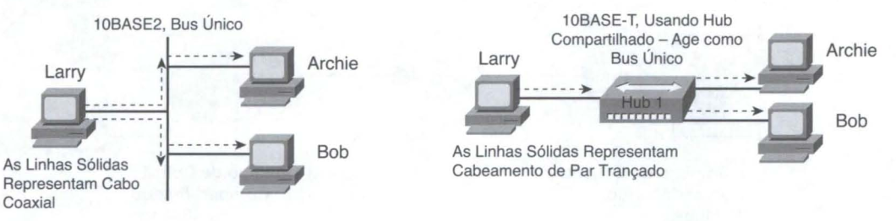
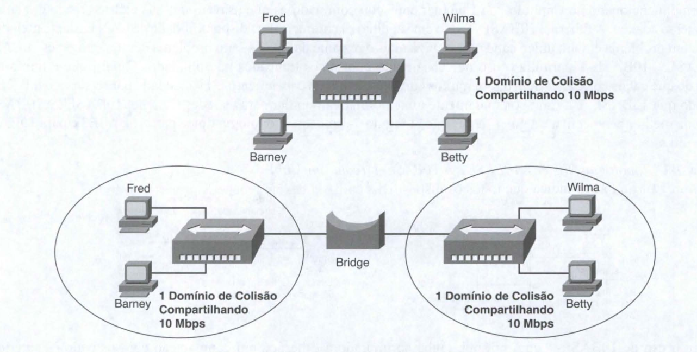
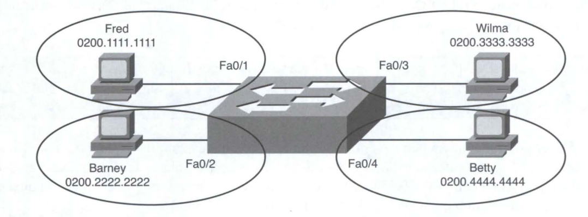
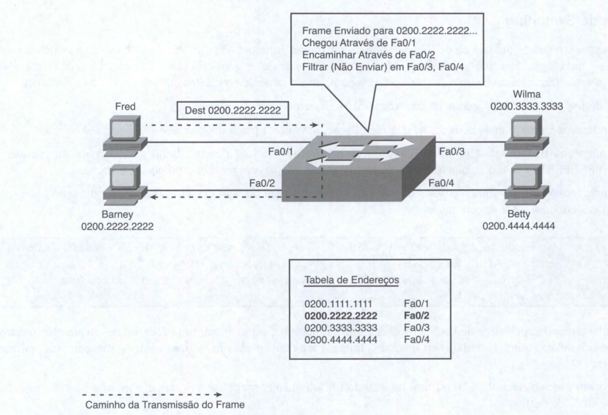
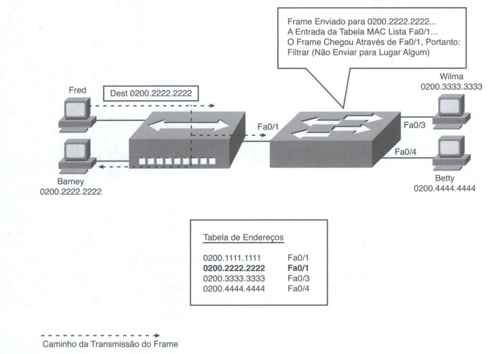
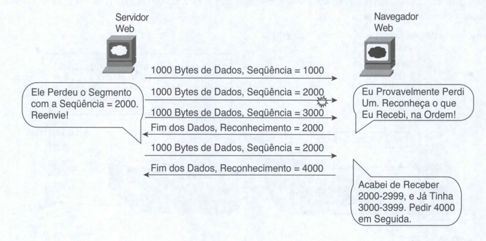
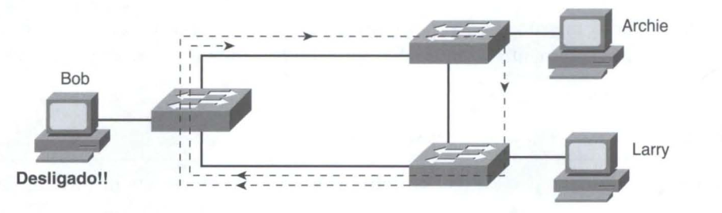
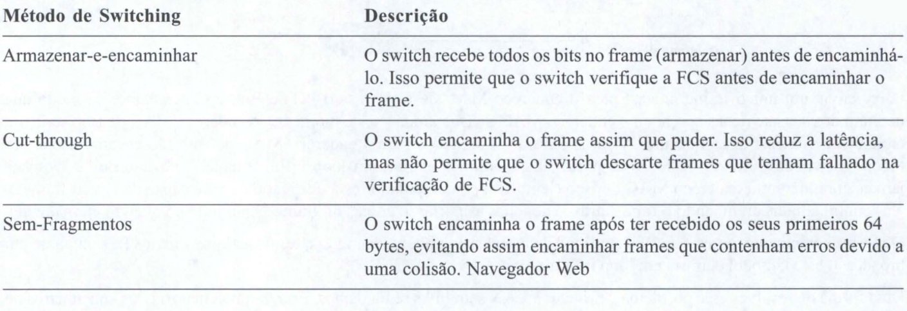
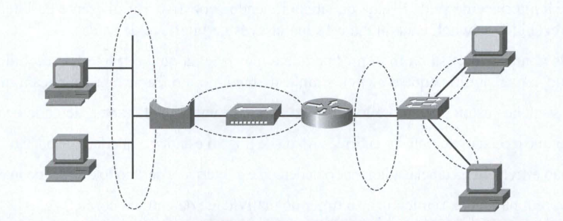
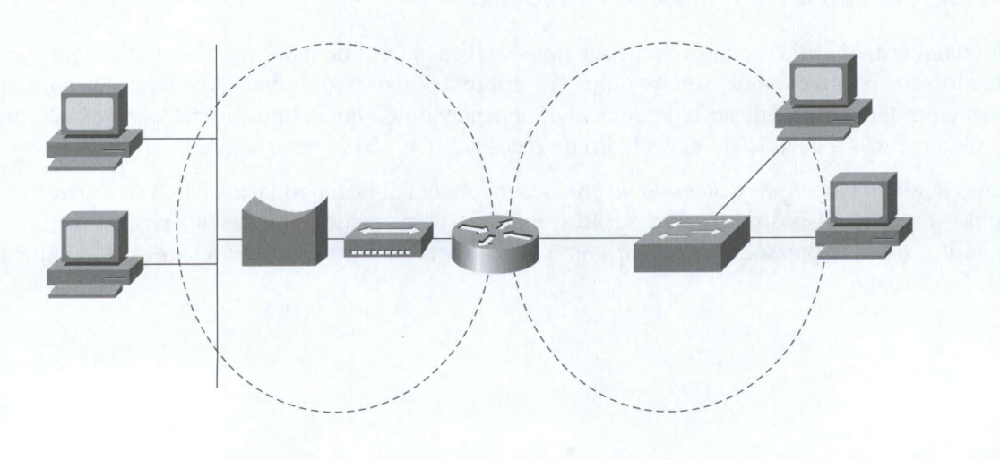

# Conceitos de switching

## Progressão Histórica: Hubs, Bridges e 5witches

A Ethernet começou com padrões que usavam um bus elétrico fisico criado com
cabeamento coaxial. A Ethernet 1OBASE-T veio em seguida. Ela oferecia uma disponibilidade de LAN bastante melhorada porque um problema em um único cabo não afetava mais o restante da LAN - um problema comum em redes 10BASE2 e 10BASE5. 1OBASE-T permitia o uso de cabeamento com pares trançados não-blindados (UTP) , que é muito mais barato do que cabos coaxiais. 

Além disso, muitos edificios já tinham cabeamento UTP instalado para o serviço telefônico, de modo que IOBASE-T tomou-se rapidamente uma alternativa popular para as redes Ethernet 1OBASE2 e 1OBASE5. Para uma melhor perspectiva e à guisa de revisão, a Figura 7-1 mostra a topologia típica para IOBASE2 e para 10BASE-T com um hub.

Embora o uso de 1OBASE-T com um hub tenha aprimorado a Ethernet, em comparação com os padrões anteriores, vários problemas continuaram a existir, mesmo com 10BASE-T usando hubs:

* Qualquer frame enviado por um dispositivo poderia colidir com um frame enviado por qualquer outro dispositivo conectado ao mesmo segmento da LAN.

* Somente um dispositivo podia enviar um frame por vez, portanto a largura de banda (lO-Mbps) era compartilhada pelos dispositivos.

* Broadcasts enviados por um dispositivo eram escutados, e processados, por todos os outros dispositivos da LAN.

Quando esses três tipos de Ethernet foram introduzidos, uma largura de banda compartilhada de 10 Mbps era muita coisa! Antes da introdução das LANs, as pessoas freqüentemente usavam terminais cegos, e um link WAN de 56 kbps era uma conexão realmente rápida com o restante da rede - e esses 56 kbps eram compartilhados com todas as pessoas em um edificio remoto. 

Assim, na época em que 1OBA SE-T começou a ser usada, ter uma conexão a uma LAN Ethernet 1OBASE-T era como ter uma conexão Ethernet Gigabit para o seu PC no trabalho hoje em dia. Era mais largura de banda do que você jamais pensou que poderia usar.

Com o tempo, o desempenho de muitas redes Ethernet começou a se degradar. As pessoas desenvolveram aplicações que se beneficiavam da largura de banda da LAN. Mais dispositivos foram adicionados a cada Ethernet. Com o tempo, a rede inteira ficou congestionada. 

Os dispositivos em uma mesma Ethernet não eram capazes de enviar (coletivamente) mais de 10 Mbps de tráfego, pois todos eles compartilhavam os 10 Mbps de largura de banda. Além disso, o aumento no volume de tráfego aumentava o número de colisões. Muito antes da utilização total da Ethernet se aproximar de 10 Mbps, a rede já começava a sofrer por causa do aumento das colisões.

Foram criadas as bridges ("pontes") Ethernet para resolver alguns dos problemas de desempenho. As bridges resolviam o crescente problema de congestão da Ethernet de duas maneiras:

* Reduziam o número de colisões que ocorriam na rede.
* Adicionavam largura de banda à rede.

A Figura abaixo mostra a premissa básica por trás de uma bridge Ethernet transparente. A parte de cima da figura mostra uma rede 1OBASE-T antes de se adicionar uma bridge e a parte de baixo mostra a rede depois dela ter sido segmentada usando-se uma bridge. A bridge cria dois dominios de colisão separados. Os frames de Fred podem colidir com os de Barney, mas não podem colidir com os de Wilma ou Betty. 

Se um segmento da LAN ficar ocupado e a bridge precisar encaminhar um frame para o segmento ocupado, a bridge simplesmente faz buffer do frame (armazena-o na memória) até que o segmento não esteja mais ocupado. Com a redução das colisões, e assumindo-se que não houve nenhuma mudança significativa no número de dispositivos ou na carga sobre a rede, melhora-se muito o desempenho da rede.

Adicionar uma bridge entre dois hubs cria, na prática, duas redes 1OBASE-T separadas - uma à esquerda e outra à direita. A rede 1OBASE-T da esquerda tem os seus próprios 10 Mbps para compartilhar, assim como a rede da direita. Assim, neste exemplo, a largura de banda total da rede é dobrada para 20 Mbps, em comparação com a rede 10BASE-T do alto da figura.

Os switches LAN realizam as mesmas funções principais que as bridges, porém com muitos recursos aprimorados. Assim como as bridges, os switches segmentam uma LAN em partes separadas, cada parte sendo um domínio de colisão separado. Os switches têm, potencialmente, grandes números de interfaces, com um hardware altamente otimizado, permitindo que switches Empresariais ainda menores encaminhem milhões de frames Ethernet por segundo. 

Ao criar um domínio de colisão separado para cada interface, os switches multiplicam a quantidade de largura de banda disponível na rede. E, como mencionado no Capítulo 3, se uma porta do switcb se conectar a um único dispositivo, esse segmento da Ethernet pode usar a lógica de full-duplex, o que na prática dobra a velocidade nesse segmento.

*A ação de se segmentar uma LAN Ethernet em um domínio de colisão por interface, realizada pelos switches, é às vezes chamada de microsegmentação.*

A Figura abaixo resume alguns desses conceitos-chave, mostrando os mesmos hosts que a Figura abaixo, mas agora conectados a um switch. Neste caso, todas as interfaces do switch estão rodando a 100 Mbps, com quatro domínios de colisão. Repare que cada interface também usa full duplex. Isso é possível porque somente um dispositivo está conectado a cada porta, o que na prática elimina as colisões para a rede mostrada.

## Lógica de Switching

Basicamente, o papel de um switch de LAN é encaminhar frames Ethernet. Para atingir esse objetivo os switches usam a lógica - uma lógica baseada no endereço MAC de origem e de destino no cabeçalho Ethernet de cada frame. Para ajudá-lo a visualizar o modo como os switches funcionam , primeiramente precisamos de uma revisão da Ethernet.

O IEEE define três categorias gerais de endereços MAC Ethernet:

* Endereços Unicast: endereços MAC que identificam uma única placa de interface LAN.

* Endereços Broadcast: Um frame enviado com um endereço de destino igual ao endereço de broadcast (FFFF.FFFF.FFFF) indica que todos os dispositivos da LAN devem receber e processar o frame.

* Endereços Multicast: Endereços MAC multicast são usados para permitir que um sub-conjunto dinâmico de dispositivos em uma LAN se comuniquem.

A principal tarefa de um switch de LAN é receber frames Ethernet e, então, tomar uma decisão : ou encaminhar o frame através de alguma(s) outra(s) porta(s) ou ignorar o frame. Para realizar essa missão, as bridges transparentes realizam três ações:

1. Decidir quando encaminhar um frame ou quando filtrar (e não encaminhar) um frame, com base no endere- ço MAC de destino

2. Aprender endereços MAC, examinando o endereço MAC de origem de cada frame recebido pela bridge

3. Criar um ambiente (de Camada 2) livre de loops com outras bridges, usando o Protocolo Spanning Tree(STP)

## A Decisão Entre Encaminhar ou Filtrar

Para decidir para onde encaminhar um frame, o switch usa uma tabela dinamicamente criada que lista endereços MAC e interfaces de saída. Os switches comparam o endereço MAC de destino do frame a essa tabela para decidir se devem encaminhar o frame ou simplesmente ignorá-lo. Por exemplo, considere a rede simples mostrada na figura abaixo, com Fred enviando um frame para Barney.

A Figura abaixo mostra um exemplo tanto da decisão de encaminhar quanto da decisão de filtrar. Fred envia um frame com o endereço de destino 0200.2222.2222 (o endereço MAC de Barney). O switch compara o endereço MAC de destino (0200.2222.2222) com a tabela de endereços MAC, encontrando a entrada correspondente. Essa é a interface através da qual o frame deve ser enviado para que possa ser entregue ao endereço MAC listado (0200.2222.2222). 

Pelo fato de a interface na qual o frame chegou (FaO/1) ser diferente da interface de saída listada (FaO/2), o switch decide encaminhar o frame através da interface FaO/2, como mostrado na tabela da figura.

*A tabela de endereços MAC do switch é também chamada de tabela de switching, ou tabela de bridging, ou até mesmo de Memória de Conteúdo Endereçável (Content Addressable Memory, ou CAM), em referência ao tipo de memória física usada para se armazenar a tabela.*

A chave para se prever por onde um switch deverá encaminhar um frame é examinar e entender a tabela de endereços. A tabela lista endereços MAC e a interface que o switch deve usar ao encaminhar pacotes enviados ao endereço MAC em questão. Por exemplo, a tabela lista 0200.3333.3333 através de FaO/3, que é a interface através da qual o switch deve encaminhar frames enviados para o endereço MAC de Wilma (0200.3333.3333).

A figura abaixo mostra uma perspectiva diferente, com o switch tomando uma decisão de filtrar. Nesse caso, Fred e Barney estão conectados a um hub, que por sua vez se conecta ao switch. A tabela de endereços MAC do switch lista os endereços MAC tanto de Fred quanto de Barney ligados à mesma interface do switch em questão (FaO/1) porque o switch encaminharia frames , tanto para Fred quanto para Barney, através da sua interface Fa0/1. 

Assim, quando o switch recebe um frame enviado por Fred (endereço MAC de origem 0200. 1111.1111) para Barney (endereço MAC de destino 0200.2222.2222), o switch pensa o seguinte: "Pelo fato de o frame ter chegado através da minha interface FaO/1, pelo fato de que eu teria de enviá-lo através dessa mesma interface FaO/1, não o envie (filtre-o), porque enviá-lo seria perda de tempo".

Repare que o hub simplesmente regenera o sinal elétrico saindo de cada interface, encaminhando assim o sinal elétrico enviado por Fred tanto para Barney quanto para o switch. O switch decide filtrar (não encaminhar) o frame ao perceber que a interface da tabela de endereços MAC para 0200.2222.2222 (FaO/1) é a mesma que a interface por onde chegou o frame.

## Como os Switches Aprendem Endereços MAC

A segunda função principal de um switch é aprender os endereços MAC e interfaces a serem colocados na sua tabela de endereços. Com uma tabela de endereços MAC completa e precisa, o switch é capaz de tomar decisões de encaminhamento ou filtragem precisas.

Os switches constroem a tabela de endereços ao monitorarem os frames recebidos e examinarem o endereço MAC de origem do frame. Se um frame entrar no switch e o endereço MAC de origem não estiver na tabela, o switch cria uma entrada na tabela. O endereço MAC é inserido juntamente com a interface através da qual o frame chegou. A lógica de aprendizado dos switches é simples assim.

A Figura abaixo mostra a mesma rede que a figura abaixo, porém antes do switch ter criado qualquer entrada na tabela de endereços. A figura mostra os dois primeiros frames enviados nesta rede - primeiramente um frame de Fred, destinado a Barney, e depois a resposta de Barney, destinada a Fred.

Como mostrado na figura, depois que Fred envia o seu primeiro frame (rotulado "1") para Barney, o switch adiciona uma entrada para 0200.1111.1111, o endereço MAC de Fred, associado com a interface FaO/1. Quando Barney responde, no Passo 2, o switch adiciona uma segunda entrada, desta vez para 0200.2222.2222, o endereço MAC de Barney, associado com a interface FaO/2, que é a interface através da qual o switch recebeu o frame. O aprendizado sempre acontece olhando-se o endereço MAC de origem do frame.

## Flooding de Frames

Agora, volte a sua atenção para o processo de encaminhamento, usando a figura acima. O que você imagina que o switch faz com o primeiro frame de Fred na figura acima, aquele que ocorreu quando não havia entradas na tabela de endereços MAC? O que acontece é que, quando não há uma entrada correspondente na tabela, os switches encaminham o frame através de todas as interfaces (exceto aquela por onde chegou o frame). 

Os switches encaminham esses frames de unicast desconhecido (frames cujos endereços MAC de destino ainda não se encontram na tabela de bridging) através de todas as outras interfaces, com a esperança de que o dispositivo desconhecido esteja em algum outro segmento da Ethernet e responda, permitindo ao switch criar uma entrada correta na tabela de endereços.

Por exemplo, na figura acima, o switch encaminha o primeiro frame através de FaO/2, FaO/3 e FaO/4, mesmo que 0200.2222.2222 (Bamey) só possa ser atingido através de FaO/2. O switch não encaminha o frame de volta por FaO/1 , pois os switches nunca encaminham um frame através da mesma interface na qual ele chegou. (Como uma nota adicional, a figura acima não mostra o frame sendo encaminhando através das interfaces FaO/3 e FaO/4, porque o foco desta figura é mostrar o processo de aprendizado.) 

Quando Bamey responde a Fred, o switcb corretamente adiciona uma entrada para 0200.2222.2222 (FaO/2) à sua tabela de endereços. Quaisquer frames posteriores enviados ao endereço de destino 0200.2222.2222 não mais precisarão ser enviados através de FaO/3 e FaO/4, sendo encaminhados apenas através de FaO/2.

O processo de se enviar frames através de todas as outras interfaces, exceto aquela por onde o frame chegou, chama-se flooding. Os switches fazem fiood de frames de unicast desconhecido e também de frames broadcast. Os switcbes também fazem flood de frames multicast LAN através de todas as portas, a não ser que tenham sido configurados para usar alguma ferramenta de otimização de multicast.

Os switches mantêm um timer para cada entrada na tabela de endereços MAC, chamado timer de inatividade. O
switcb define o timer como O para novas entradas. Cada vez que o switch recebe um novo frame com o mesmo endereço MAC de origem, o timer é reinicializado como O. O timer conta para cima, de modo que o switcb é capaz de saber quais entradas passaram o maior espaço de tempo sem receber um frame do dispositivo em questão. Se o switcb por acaso ficar sem espaço para novas entradas na tabela de endereços MAC, ele pode remover da tabela entradas com os timers de inatividade mais antigos (maiores).

## Evitando Loops com o Protocolo Spanning Tree

A terceira funcionalidade principal dos switches LAN é a prevenção de loops, conforme implementada pelo Protocolo Spanning Tree (Spanning Tree Protocol, ou STP). Sem o STP, os frames ficariam em loop durante um período de tempo indefinido, em redes Ethernet com links fisicamente redundantes. Para evitar o looping de frames, o STP bloqueia algumas portas, impedindo-as de encaminhar frames , de modo que só exista um caminho ativo entre qualquer par de segmentos da LAN (domínios de colisão). O resultado do STP é positivo: os frames não entram em loops infinitos, o que tomaria a LAN inutilizável. Entretanto, embora a rede possa usar alguns links redundantes no caso de falhas, a LAN não equilibra o tráfego.

Para evitar loops de Camada 2, todos os switches precisam usar o STP. O STP faz com que cada interface de um switch permaneça em um estado ou de bloqueio ou de encaminhamento. Bloqueio significa que a interface não poderá encaminhar ou receber frames de dados. Encaminhamento significa que a interface pode enviar e receber frames de dados. Se um subconjunto correto das interfaces for bloqueado, um único caminho lógico poderá estar ativo atualmente entre cada par de LANs.

Um exemplo simples tomará mais óbvia a necessidade de se usar o STP. Lembre-se, os switches fazem fiood de frames enviados tanto a endereços MAC de unicast desconhecido quanto a endereços broadcast.

A Figura abaixo mostra que um único frame, enviado por Larry para Bob, entra em loop infinito porque a rede possui redundância, mas não STP.

Larry envia um único frame unicast para o endereço MAC de Bob, mas o PC de Bob está desligado, de modo que
nenhum dos seus switches aprendeu o endereço MAC de Bob ainda. Neste momento, o endereço MAC de Bob seria um endereço de unicast desconhecido. Assim, os frames destinados para o endereço MAC de Bob são encaminhados por todos os switches, através de todas as portas. Esses frames entram em loop infinitamente. Pelo fato de os switches jamais aprenderem o endereço MAC de Bob (lembre-se, o computador está desligado e não é capaz de enviar frames), eles continuam encaminhando o frame através de todas as portas, e cópias do frame ficam indo e voltando eternamente. 

De forma semelhante, os switches fazem flood de broadcast também, de modo que, se qualquer um dos PCs enviasse um broadcast, este também entraria em loop infinito. Uma forma de resolver esse problema é projetar a LAN sem links redundantes. Entretanto, a maioria dos engenheiros de rede elabora as LANs para usarem redundância física entre os switches. Mais cedo ou mais tarde, um switch ou um link falhará e você desejará que a rede permaneça disponível, o que é possível ao se ter alguma redundância no projeto da
LAN. 

A solução correta inclui LANs com switches e redundância física, enquanto se usa o STP para bloquear dinamicamente alguma(s) interface(s) de modo tal que exista apenas um caminho ativo entre dois terminais a qualquer momento.

## Processamento Interno em Switches

Alguns switches, e bridges transparentes em geral, usam o processamento armazenar-e-encaminhar. Com esse processo, o switch precisa receber o frame inteiro antes de poder encaminhar o primeiro bit do frame. Entretanto, a Cisco também oferece outros dois métodos de processamento interno para os switches: cut-through e sem-fragmentos. Pelo fato de que o endereço MAC de destino aparece logo no início do cabeçalho Ethernet, o switch é capaz de tomar uma decisão de encaminhamento muito antes de ter recebido todos os bits do frame. Os métodos de processamento cut-through e sem-fragmentos permitem que o switch comece a encaminhar antes que o frame inteiro tenha sido recebido, reduzindo-se o tempo requerido para se enviar o frame (a latência, ou delay).

Com o processamento cut-through, o switch começa a enviar o frame através da porta de saída assim que possível. Embora isso possa reduzir a latência, também propaga erros. Devido ao fato de a seqüência de verificação do frame (FCS) ficar no rodapé Ethernet, o switch não é capaz de determinar se o frame tinha erros antes de começar a encaminhá-lo. Assim, o switch reduz a latência do frame, mas ao custo de encaminhar alguns frames contendo erros.

O processamento sem-fragmentos funciona de forma semelhante ao cut-through, mas tenta reduzir o número de frames com erros encaminhados. Um fato interessante sobre a lógica CSMAlCD da Ethernet é que as colisões devem ser detectadas dentro dos primeiros 64 bytes de um frame. O processamento sem-fragmentos funciona de forma parecida com a lógica cut-through, mas ele espera para receber os primeiros 64 bytes antes de encaminhar um frame. 

Os frames enfrentam muito menos latência do que com a lógica de armazenar-e-encaminhar, e ligeiramente menos latência do que com cut-through, porém os frames que têm erros como resultado de colisões não são encaminhados.

Com muitos links ao desktop rodando a 100 Mbps, uplinks a 1 Gbps e circuitos integrados específicos para aplicações (ASIC) mais rápidos, os switches de hoje em dia geralmente usam processamento armazenar-e-encaminhar, porque a latência aprimorada dos outros dois métodos de switching toma-se negligível a essas velocidades. Os algoritmos de processamento interno usados pelos switches podem variar conforme os modelos e os fabricantes ; independentemente disso, o processamento interno pode ser categorizado como um dos métodos listados na tabela abaixo:

## Resumo do Switching de LANs

Os switches propiciam muitos recursos adicionais não oferecidos por dispositivos de LAN antigos, tais como hubs e bridges. Em particular, os switches LAN oferecem os seguintes beneficios:

* As portas do switch conectadas a um mesmo dispositivo micro segmentam a LAN, fornecendo largura de
banda dedicada no dispositivo em questão.

* Os switches permitem múltiplas conversações simultâneas entre dispositivos de diferentes portas.

* As portas do switch conectadas a um mesmo dispositivo suportam fuH duplex, o que na prática dobra a quantidade de largura de banda disponível para o dispositivo em questão.

* Os switches têm suporte à adaptação de taxa, o que significa que os dispositivos que usam diferentes velocidades Ethernet podem se comunicar através do switch (os hubs não têm essa funcionalidade).

Os switches usam lógica de Camada 2, examinando o cabeçalho data-link Ethernet para decidir como processar os frames . Em particular, os switches tomam decisões sobre encaminhar e filtrar frames, aprender endereços MAC e usar STP para evitar loops da seguinte maneira:

1. Os switches encaminham frames com base no endereço de destino:

1.1 Se o endereço de destino for um broadcast, multicast ou unicast desconhecido (um unicast não
listado na tabela MAC), o switch faz fioods com o frame.

1.2 Se o endereço de destino for um endereço unicast conhecido (um endereço unicast encontrado na tabela
MAC):

1.2.1 Se a interface de saída listada na tabela de endereço MAC for diferente da interface na qual o frame foi recebido, o switch encaminha o frame através da interface de saída.

1.2.2 Se a interface de saída for a mesma que a interface na qual o frame foi recebido, o switch filtra o
frame, o que significa que o switch simplesmente ignora o frame e não o encaminha.

2 Os switches usam a seguinte lógica para aprender entradas da tabela de endereços MAC:

2.1 Para cada frame recebido, examinar o endereço MAC de origem e anotar a interface de onde o frame foi recebido.

2.2 Se ainda não estiverem na tabela, adicionar o endereço e a interface, definindo o timer de inatividade como O.

2.3 Se já estiverem na tabela, reinicializar o timer de inatividade da entrada como O.

3. Os switches usam STP para impedir loops, ao fazerem algumas interfaces bloquearem, o que significa que eles não enviam e nem recebem frames.

## Domínios de Colisão e Domínios de Broadcast

Ao se criar qualquer LAN Ethernet, usa-se alguns tipos de dispositivos de rede - hoje em dia, geralmente switches - alguns roteadores e possivelmente alguns hubs. As diferentes partes de uma LAN Ethernet podem se comportar diferentemente em termos de função e desempenho, dependendo de quais tipos de dispositivos são utilizados. 

Essas diferenças afetam então a decisão do engenheiro de redes sobre como projetar a LAN.
As expressões domínio de colisão e domínio de broadcast definem dois importantes efeitos do processo de se segmentar LANs usando-se vários dispositivos. Esta seção examinará os conceitos por trás do projeto de LANs Ethernet. O objetivo é definir essas expressões e explicar como hubs, switches e roteadores afetam os domínios de colisão e os domínios de broadcast.

## Domínios de Colisão

Conforme mencionado anteriormente, um domínio de colisão é o conjunto de interfaces LAN cujos frames poderiam colidir uns com os outros, mas não com frames enviados por quaisquer outros dispositivos na rede. Para revisar o conceito central, a Figura abaixo ilustra os domínios de colisão.

*O projeto de LAN da figura acima não é um projeto típico usado hoje em dia. Está sendo apresentado simplesmente para fornecer as informações necessárias para que você possa comparar hubs, switches e roteadores.*

Cada segmento separado, ou domínio de colisão, é mostrado com um círculo pontilhado na figura . O switch da direita separa a LAN em diferentes domínios de colisão para cada porta. Da mesma forma, tanto as bridges quanto os roteadores também separam as LANs em diferentes domínios de colisão (embora esse efeito com os roteadores não tenha sido abordado anteriormente neste livro). De todos os dispositivos na figura, somente o hub perto do centro da rede não cria múltiplos domínios de colisão para cada interface. Ele repete todos os frames através de todas as portas sem nenhuma preocupação com buffering ou em esperar para enviar o frame a um segmento ocupado.

## Domínios de Broadcast

A expressão domínio de broadcast refere-se aos lugares para onde os broadcasts podem ser encaminhados. Um
domínio de broadcast abarca um conjunto de dispositivos para os quais, quando um deles envia um broadcast, todos os demais recebem uma cópia desse broadcast. Por exemplo, os switches fazem fiood de broadcasts e multicasts em todas as portas. Devido ao fato de frames broadcast serem enviados através de todas as portas, um switch cria um único domínio de broadcast. Inversamente, apenas os roteadores param o fluxo dos broadcasts. Para uma melhor perspectiva, a Figura abaixo fornece os domínios de broadcast para a mesma rede mostrada na Figura abaixo.

Os broadcasts enviados por um dispositivo em um domínio de broadcast não são encaminhados para dispositivos de outro domínio de broadcast. Neste exemplo, existem dois domínios de broadcast. Por exemplo, o roteador não encaminha um broadcast LAN enviado por um PC da esquerda para o segmento de rede à direita. Antigamente, a expressão firewall de broadcast descrevia o fato de que os roteadores não encaminhavam broadcasts LAN.

As deftnições gerais para domínio de colisão e domínio de broadcast são as seguintes:

* Um domínio de colisão é um conjunto de placas de interface de rede (N1Cs) para o qual um frame enviado
por uma NIC poderia resultar em colisão com um frame enviado por outra NIC do mesmo domínio de colisão.

* Um domínio de broadcast é um conjunto de NICs para o qual um frame de broadcast enviado por uma NIC é
recebido por todas as outras NICs do mesmo domínio de broadcast.

