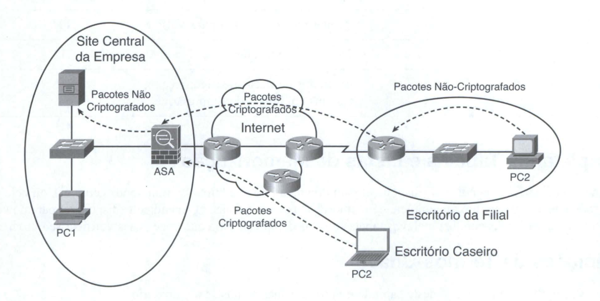

# Redes Privadas Virtuais (VPN)

A última classe de ferramentas de segurança introduzida neste capítulo será a rede privada virtual (virtual private network, ou VPN), cujo nome mais preciso seria WAN privada virtual. Uma linha alugada é inerentemente segura, agindo na prática como um circuito elétrico entre os dois roteadores. Os VPNs enviam pacotes através da Internet, que é uma rede pública. Entretanto, os VPNs tornam a comunicação segura, como em uma linha alugada privada. 

Sem a tecnologia VPN, os pacotes trocados entre dois dispositivos através da Internet são inerentemente inseguros. Os pacotes que viajam através da Internet podem ser interceptados por hackers. Na realidade, junto com o crescimento da Internet, os hackers encontraram maneiras de redirecionar pacotes e examinar o seu conteúdo, tanto para ver os dados como para encontrar informações adicionais (como nomes de usuário e senhas), como parte de um ataque de reconhecimento. Além disso, os usuários e os servidores talvez não sejam capazes de perceber a diferença entre um pacote legítimo, de um usuário autenticado, e um pacote enviado por um hacker que está tentando obter ainda mais informações e acesso.

As VPNs fornecem uma solução para permitir o uso da Internet sem os riscos de se aceitar inadvertidamente dados de hosts mal-intencionados e sem o risco de pessoas lendo os dados em trânsito. As VPNs autenticam os terminais da rede privada virtual, o que significa que ambos os terminais podem ter certeza de que o outro é legítimo. Além disso, as VPNs criptografam os pacotes IP originais de modo que mesmo se um hacker conseguir uma cópia dos pacotes à medida que eles atravessam a Internet, ele não poderá ler os dados. A Figura abaixo mostra a idéia geral, com uma VPN de intranet e uma VPN de acesso.

A figura mostra um exemplo de dois tipos de VPNs: uma VPN de acesso e uma VPN Intranet de site-a-site. Uma VPN de acesso oferece suporte a um usuário de escritório caseiro ou pequeno, com o PC do escritório remoto geralmente criptografando os pacotes. Uma VPN intranet site-a-site geralmente conecta dois sites da mesma Empresa o que, na prática, cria uma conexão segura entre duas partes diferentes dentro da mesma rede Empresarial. Para VPNs de intranets, a criptografia poderia ser feita para todos os dispositivos usando-se diferentes tipos de hardware, incluindo roteadores, firewalls, hardware concentrador de VPN específicos.

