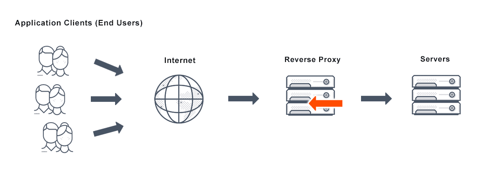
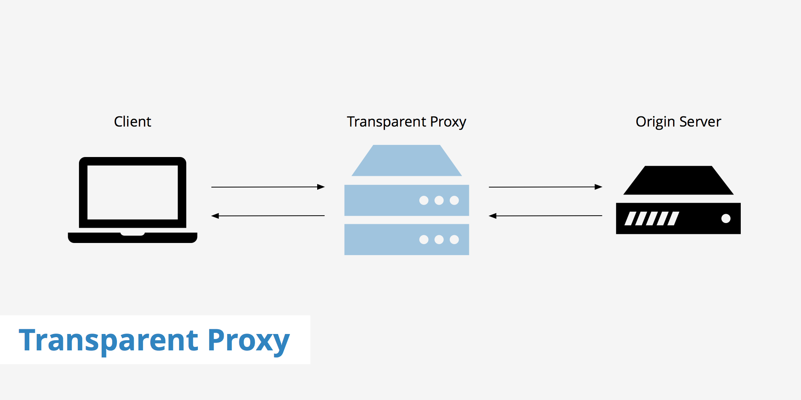

# Proxies

Um servidor proxy é um software ou hardware que atua como um intermediário entre o usuário que solicita algo e o servidor que fornece o que ele está procurando. É o servidor que está entre o usuário e as páginas da web que deseja navegar.  

Um servidor proxy é basicamente um computador na Internet equipado com seu próprio  endereço IP . Em vez de o usuário se conectar diretamente ao site pretendido, o usuário envia sua solicitação ao servidor proxy que avalia a solicitação e a conclui. Os proxies funcionam como um método para simplificar ou gerenciar solicitações complexas e fornecem uma camada adicional de segurança, privacidade e estrutura para encapsulamento . Os servidores proxy têm o potencial de cobrir a verdadeira identidade do solicitante do servidor de recurso. 

Os proxies de hardware ficam entre sua rede e a Internet, de onde eles recebem, avaliam, enviam e encaminham solicitações. Proxies de software tendem a ser acomodados por um provedor ou existem na nuvem. Às vezes, os proxies de software podem ser instalados gratuitamente ou mediante o pagamento de uma taxa. Proxies pagos são capazes de atender às demandas de negócios.  

## Tipos comuns de servidores proxy 

Proxy reverso

Representa o servidor. Caso haja vários sites em servidores diferentes, é tarefa de um servidor proxy reverso ouvir a solicitação do cliente e redirecionar para o servidor da Web específico.
Exemplo – Ouça as conexões de site da porta TCP 80. Estes são normalmente colocados em uma zona DMZ para serviços publicamente acessíveis e protegem a verdadeira identidade do host. É transparente para os usuários externos, pois os usuários externos não poderão identificar o número real de servidores internos. 

É função do proxy reverso redirecionar o fluxo dependendo das configurações dos servidores internos. A solicitação feita para passar pela rede privada protegida por firewalls precisa de um servidor proxy que não obedece a nenhuma política local. Esse tipo de solicitação dos clientes é concluída usando servidores proxy reverso. Isso também é usado para restringir o acesso do cliente aos dados confidenciais que residem nos servidores específicos.

Tipos de proxy reverso: Nginx, Traefik, Lighthttpd, Haproxy

Proxy transparente

Este tipo de servidor proxy nunca fornece qualquer anonimato ao cliente; em vez disso, um endereço IP original pode ser facilmente detectado usando esse proxy. Ainda assim, está sendo usado para atuar como um cache para os sites.

Um proxy transparente combinado com gateway resulta em um servidor proxy onde as solicitações de conexão do IP do cliente são redirecionadas. Esse redirecionamento ocorre sem a configuração do endereço IP do cliente. Esse redirecionamento pode ser facilmente detectado pelos cabeçalhos HTTP presentes no lado do servidor.

Proxy transparente geralmente são utilizando no meio corporativo, onde o gateway da rede direciona o tráfego http / https para um proxy transparente gerenciar o acesso / bloqueio a sites assim como armazenar cache.

Tipos de proxy transparente: goproxy, squid
 

